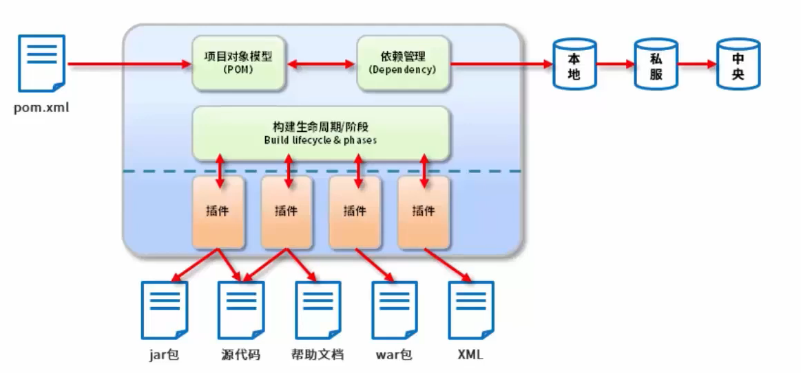
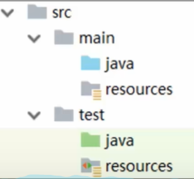
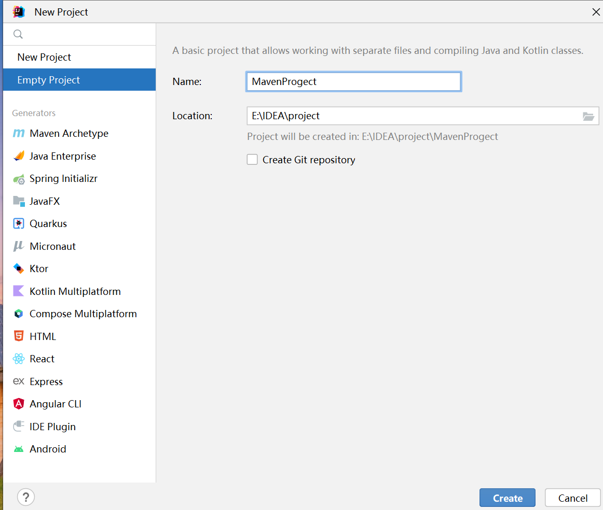
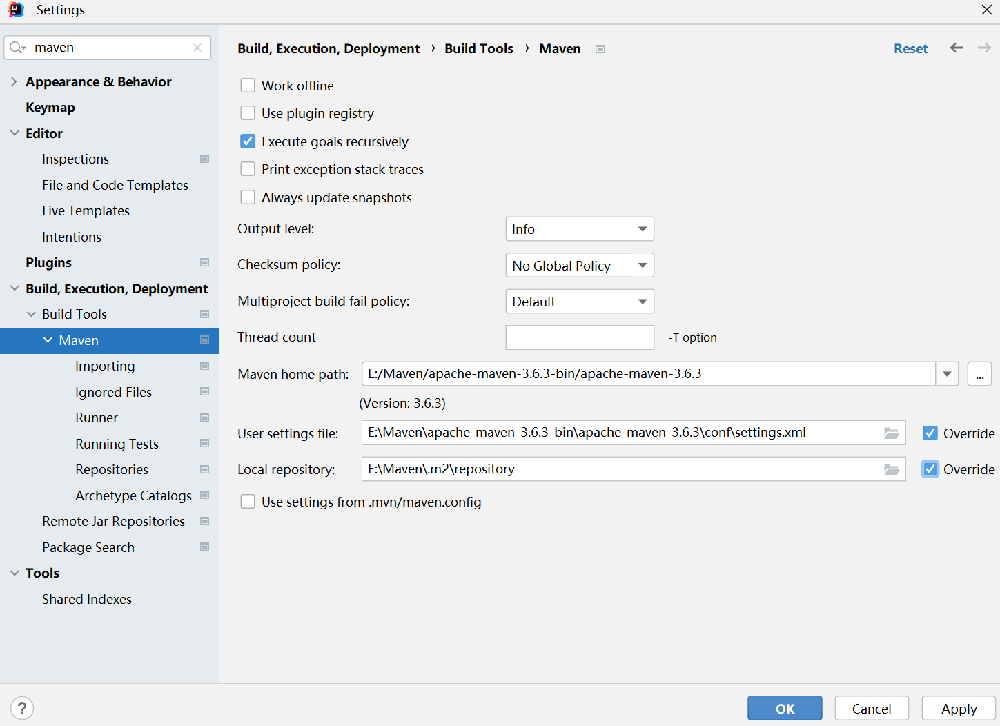
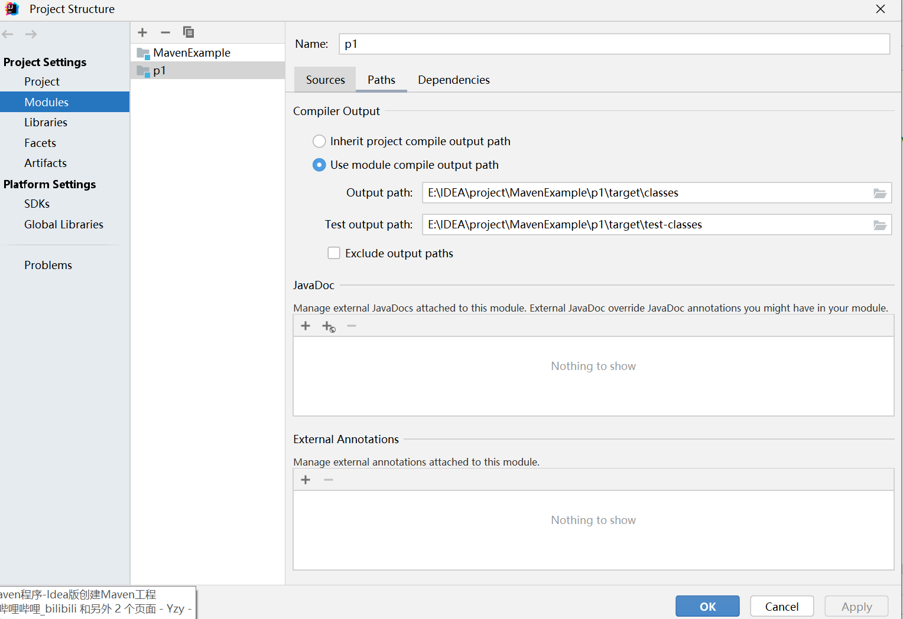
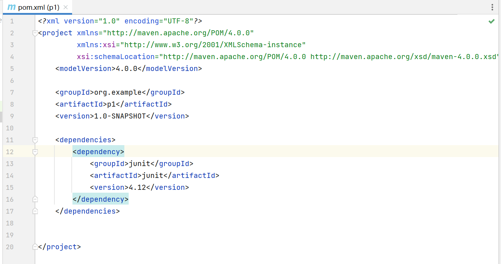
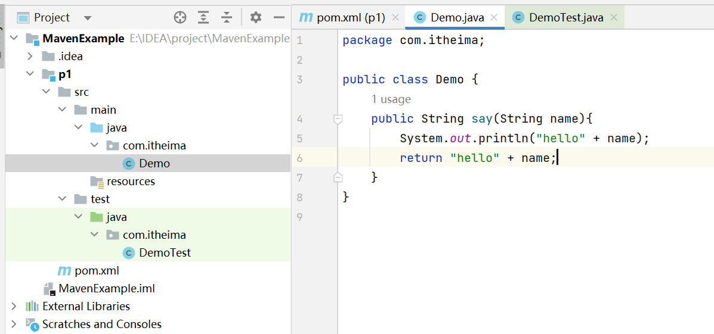
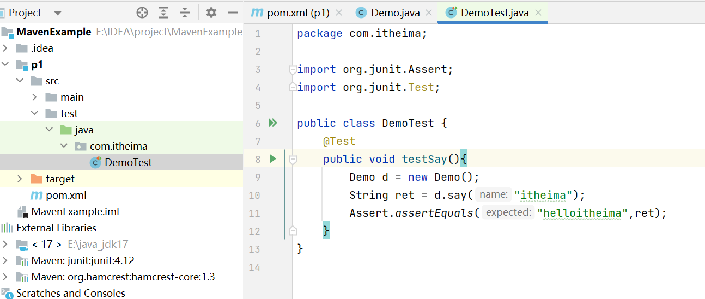
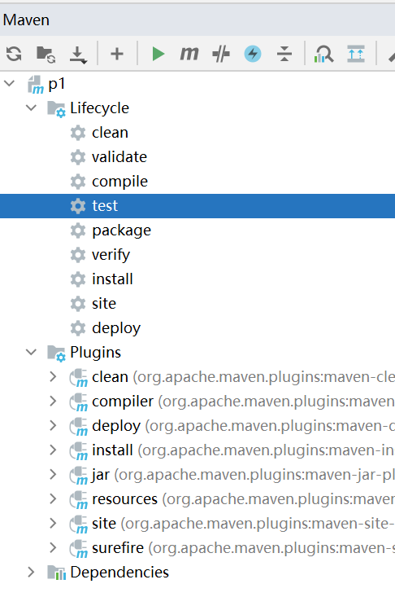
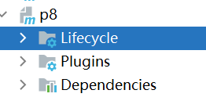

# 1、简介

Maven是一个项目管理工具，将项目开发和管理过程抽象为一个项目对象模型（POM），即将一个项目当做一个对象。



作用：

- 项目构建：提供标准的、跨平台的自动化项目构建方式
- 依赖管理：方便快捷的管理项目依赖的资源（jar包），避免资源间的版本冲突问题
- 统一开发结构：提供标准的、统一的项目结构，如下




# 2、安装

本机在E盘的maven目录下面


# 3、Maven基础概念——仓库、坐标

## 3.1仓库

含义 ：用于存储资源，包含各种jar包


解释：maven团队维护了一个中央仓库，里面包含所有的可以公开的jar包。公司有自己的私服，其中包含中央仓库的子集（也包含公司自己创建的jar包，不想让别人使用），本地要想访问，可以先从私服拿，不行再向中央拿。

本地仓库：E盘下，Maven下，有个.m2文件，其为仓库

## 3.2坐标

含义：Maven中的坐标用于描述仓库中的jar包的位置，是唯一的

组成：

使用：在网站mvnrepository.com中，搜索junit，选择4.12版本，有如下界面


这个即为其坐标。


# 4、手工搓Maven

略

# 5、IDEA下的Maven

1、创建空项目



2、在settings中查找maven（修改三个路径）



3、打开项目结构，新建模块p1，p1即为maven项目



4、在pom.xml中加入依赖



5、main下写程序Demo



6、test下写程序DemoTest



7、在旁边的maven中的lifecycle中双击哪个工具就运行哪个



- 点击compile将会编译，产生target目录
- 点击clean将清除target目录
- 点击test将会ces
- 点击package将执行编译和测试


# 6、使用模板（archetype）快速创建java项目和web项目

## 6.1 java项目

1、打开项目结构，新建p2，注意使用maven模板（quickstart）


2、就会生成项目了

## 6.2 web项目

1、模板为webapp


2、结构如下


3、修改一下


# 7、启动web项目（tomcat插件）

1、先把web项目（p8）的pom改成下面的


2、在maven网站找tomcat插件，且复制地址


3、在pom中新建build，然后将复制的东西放进去（删掉depend那个）


4、双击运行tomcat7下的run


5、网站如下


6、如果出错：不能找到xxxxxx

解决：


在新项目的settings中，修改importing和runner


在vm options for importer中加入

```
-Dmaven.wagon.http.ssl.insecure=true -Dmaven.wagon.http.ssl.allowall=true  
```

在runner的VM options中加入


```
-Dmaven.wagon.http.ssl.insecure=true -Dmaven.wagon.http.ssl.allowall=true -Dmaven.wagon.http.ssl.ignore.validity.dates=true -DarchetypeCatalog=internal

```

7、介绍一下pom的结构

```
<?xml version="1.0" encoding="UTF-8"?>

<project xmlns="http://maven.apache.org/POM/4.0.0" xmlns:xsi="http://www.w3.org/2001/XMLSchema-instance"
  xsi:schemaLocation="http://maven.apache.org/POM/4.0.0 http://maven.apache.org/xsd/maven-4.0.0.xsd">
  <!--maven版本-->
  <modelVersion>4.0.0</modelVersion>
  <!--组织id-->
  <groupId>org.example</groupId>
  <!--项目id-->
  <artifactId>p8</artifactId>
  <!--版本id，snapshot为开发板，release为完成版-->
  <version>1.0-SNAPSHOT</version>
  <!--打包方式-->
  <packaging>war</packaging>
  <!--依赖-->
  <dependencies>
  </dependencies>

  <!--新加的-->
  <build>
    <!--设置插件-->
    <plugins>
      <plugin>
        <groupId>org.apache.tomcat.maven</groupId>
        <artifactId>tomcat7-maven-plugin</artifactId>
        <version>2.1</version>
      </plugin>
    </plugins>
  </build>
  
</project>
```


# 8、依赖管理

## 1、依赖配置

含义：依赖是当前项目运行所需要的jar，一个项目可以设置多个依赖


## 2、依赖传递

模块A直接依赖于模块/包B，模块/包B直接依赖于模块/包C

我们称模块A间接依赖于模块/包C，对于A来说，C是可以正常使用的，这个就叫传递性


## 3、依赖的范围

<scope>标签，用来设置该依赖的范围


# 9、生命周期与插件



双击生命周期可以执行对应周期的功能；双击插件可以执行对应插件的功能。

每个生命周期都会对应相应的插件，代表应该执行这些插件。我们可以在生命周期中人为加上其他应该执行的插件。


# 10、分模块开发

好处：方便

做法：比如要将controller包分出来，需要先重新建立一个工程，然后把controller包原封不动拖进去，然后把新工程的三要素作为依赖加入到原先的工程中。**注意，在启动之前，还需要对新工程进行install操作，即将新工程的jar安到本地仓库，不然原来的工程会报错。**


# 11、聚合

问题：如下图，上面的三个工程都依赖于pojo，如果某一条把pojo的内容改了，则上面三个也要跟着改，太麻烦，我们希望他们可以自动更改


解决：


如下图：01为管理的工程，我们需要将其打包方式改为pom，然后在下面写出其管理的工程即可


# 12、继承

概念：继承描述的是两个工程之间的关系，与java中的类似，子工程可以继承父工程中的配置信息，常用于简化开发。**继承和聚合常常是一起使用的，聚合中的管理工程常常被作为父工程。**

在上图的02中，写入几句话（如下图）


则，此时此刻，02工程将可以使用01的所有的依赖

# 13、版本问题


# 14、配置多环境

在父工程的pom中


# 15、跳过测试

点击maven的蓝色闪电符号即可跳过测试


# 16、私服

私服中的仓库分为三种


还有私服的上传与下载操作。
