# 1、简介

Maven是一个**管理java项目的工具**。当git来学习。

作用：

- 项目构建：提供标准的、跨平台的自动化项目构建方式。比如编译和打包，人家提供好了，不用自己javac
- 依赖管理：方便快捷的管理项目依赖的资源（jar包），避免资源间的版本冲突问题
- 统一开发结构：提供标准的、统一的项目结构，如下，否则不同的开发工具比如idea和eclipse的项目不通用

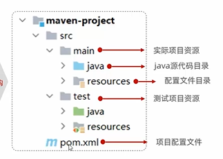


# 2、安装

maven是阿帕奇的开源项目，下载在了E盘的maven目录下


# 3、基础—仓库、坐标

## 3.1仓库

含义 ：用于存储资源，包含各种jar包

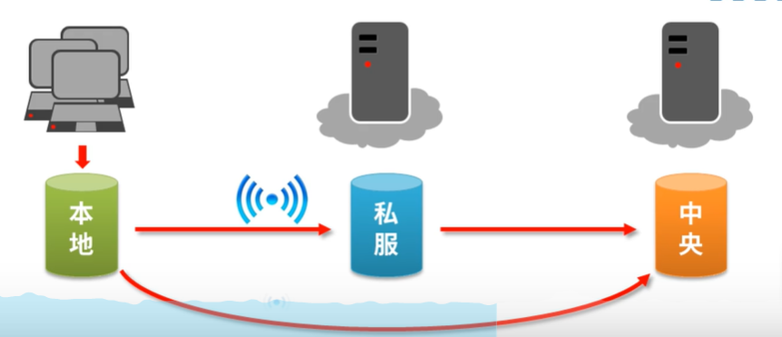

解释：maven团队维护了一个中央仓库，里面包含所有的可以公开的jar包。公司有自己的私服，其中包含中央仓库的子集（也包含公司自己创建的jar包，不想让别人使用），本地要想访问，可以先从私服拿，不行再向中央拿。

本地仓库：E盘下，Maven下，有个.m2文件，其为本地仓库（在settings.xml中修改）

也配置好了aliyun为私服，避免从中央仓库下载拖慢速度（在settings.xml中修改）

## 3.2坐标

含义：Maven中的坐标用于描述仓库中的jar包的位置，是唯一的（其实就是身份ID）

组成：

使用：在网站mvnrepository.com中，搜索junit，选择4.12版本，有如下界面

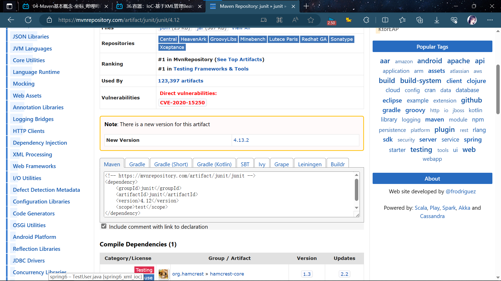

这个即为其坐标。


# 4、手工Maven

略

# 5、IDEA下Maven

## 5.1配置maven环境

1、创建空项目mavenlearn

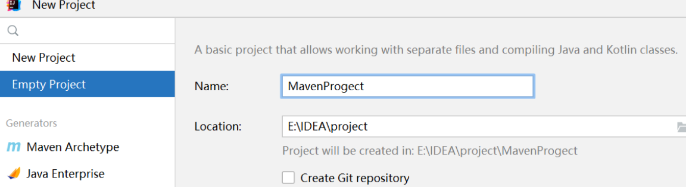

2、在settings\build\build tools中查找maven（修改三个路径）

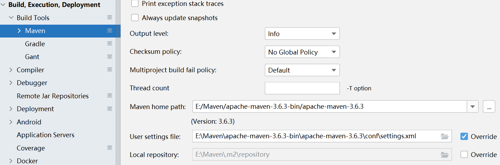

3、修改maven的java编译器为17

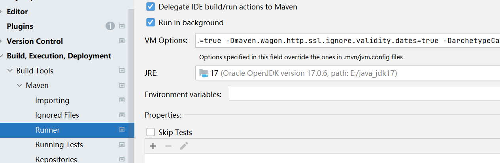

4、确认本项目的编译器为17

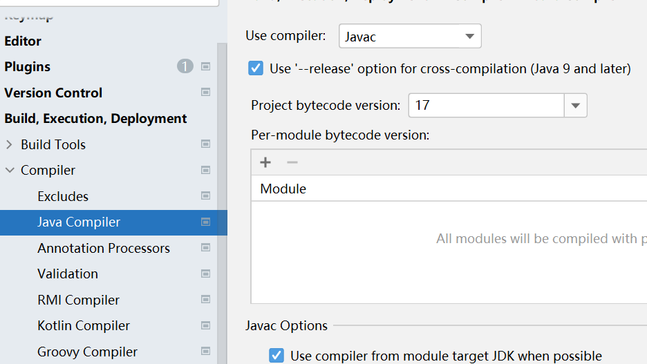

5、以上为单个项目的maven引入流程，我们也可以弄个全局的配置，就不用每次都这么搞了。在下面的窗口选择setting，重复上面的流程搞一遍就是全局的了

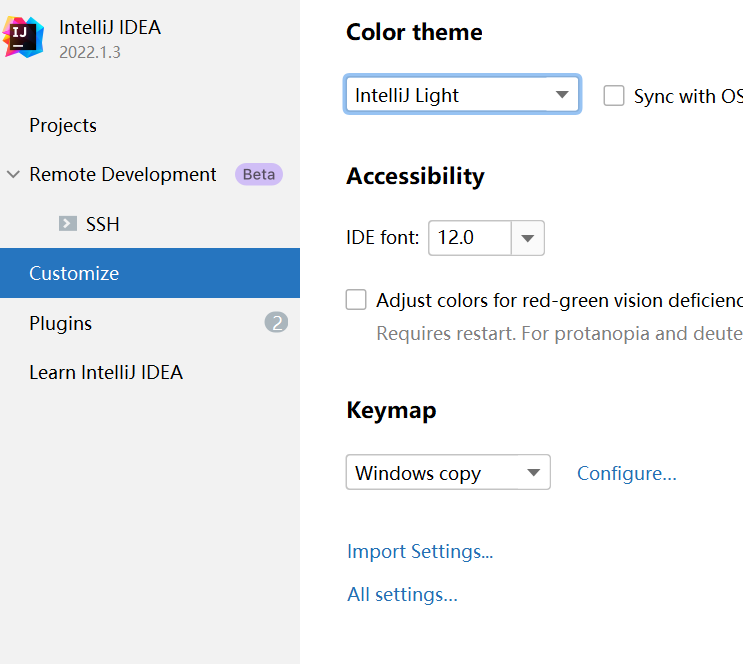

## 5.2创建maven项目

在mavenlearn下创建module，记得修改jdk为17。

注：之前学的java项目的字节码文件在out里面，但是现在maven项目的字节码文件在**src同级的target下面**，黄色标识。（比如在main的java下面新建包，新建类，然后运行，就会自动生成target目录）

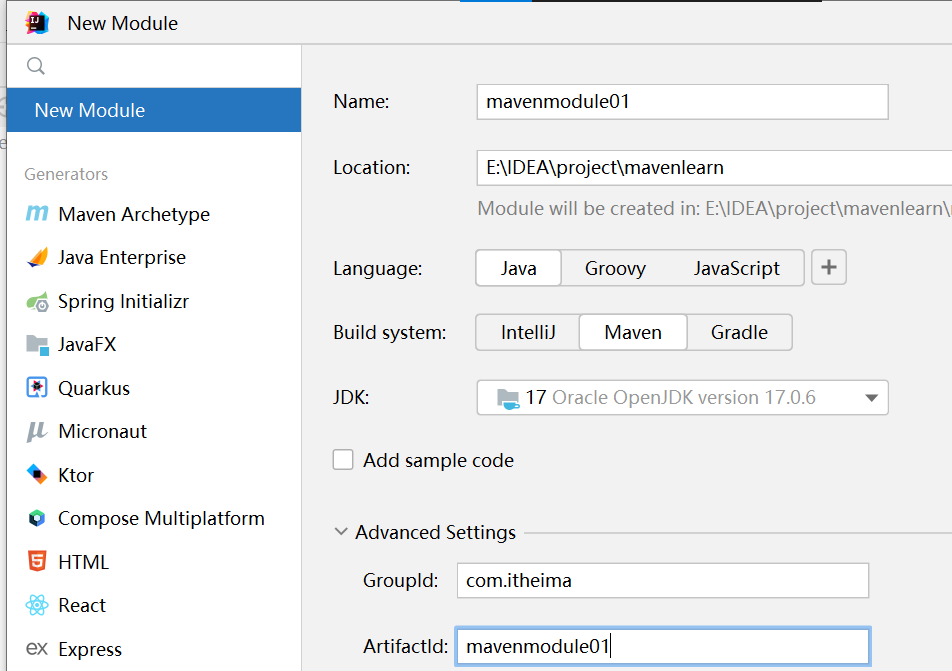

或者也可以导入别的模块。

# 6、使用模板（archetype）快速创建java项目和web项目

## 6.1 java项目

1、打开项目结构，新建p2，注意使用maven模板（quickstart）

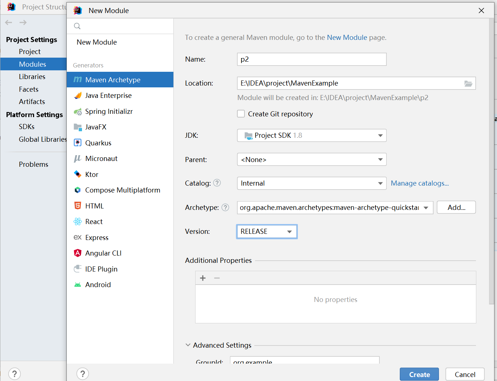

2、就会生成项目了

## 6.2 web项目

1、模板为webapp

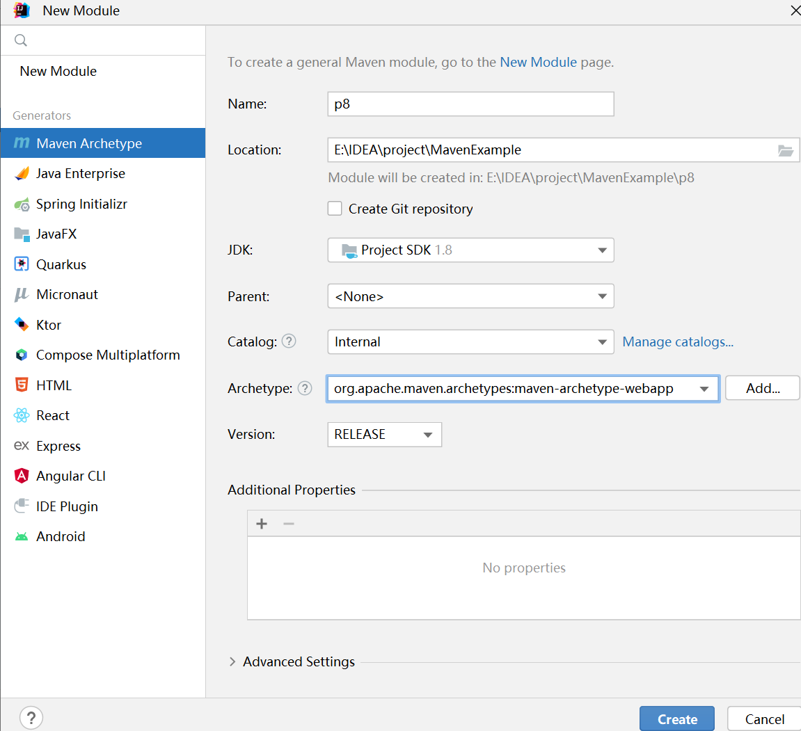

2、结构如下

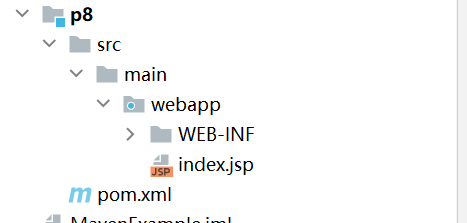

3、修改一下

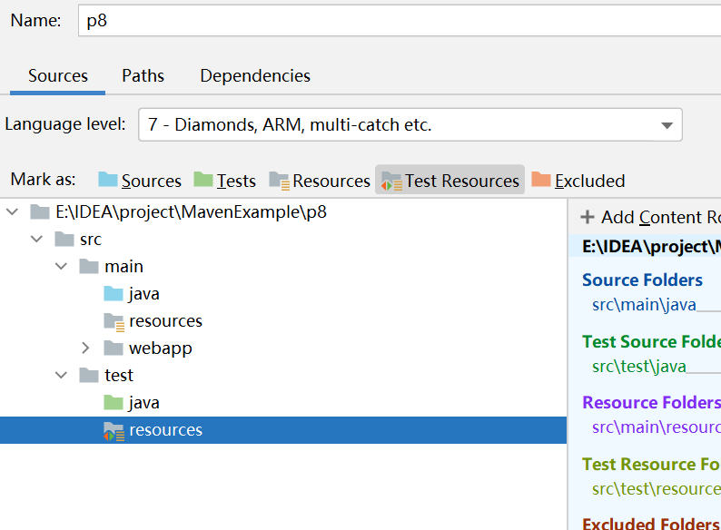


# 7、启动web项目（tomcat插件）

1、先把web项目（p8）的pom改成下面的

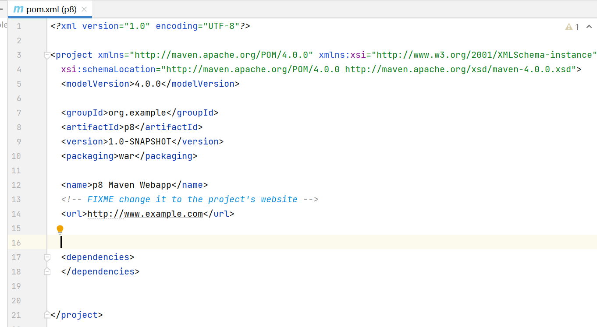

2、在maven网站找tomcat插件，且复制地址

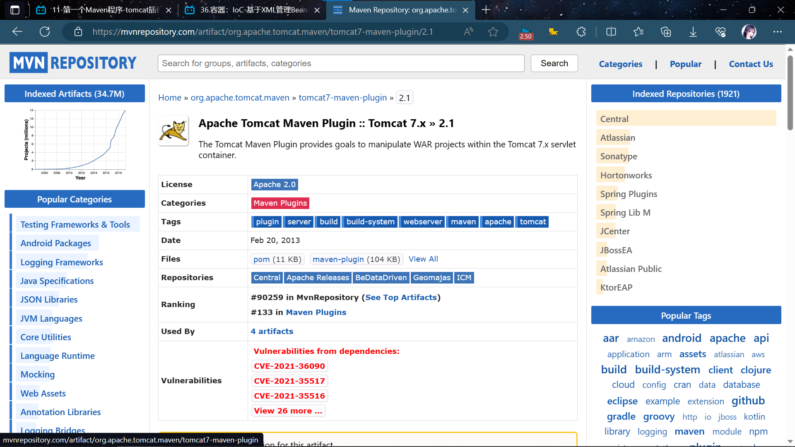

3、在pom中新建build，然后将复制的东西放进去（删掉depend那个）

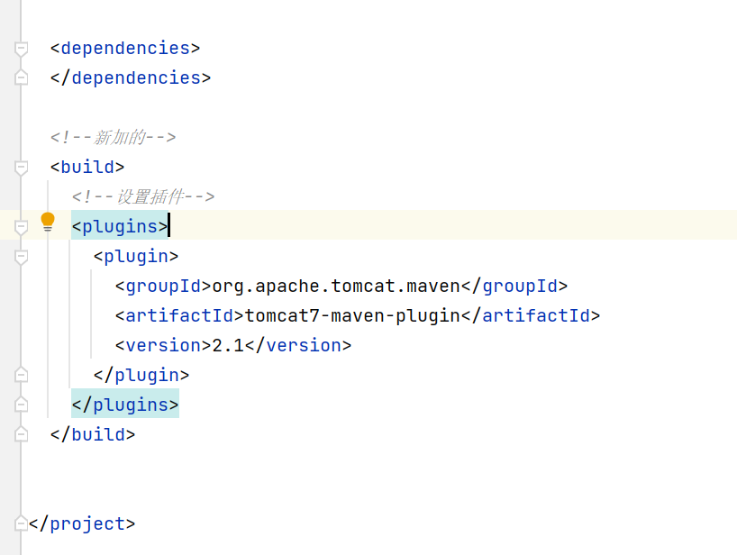

4、双击运行tomcat7下的run

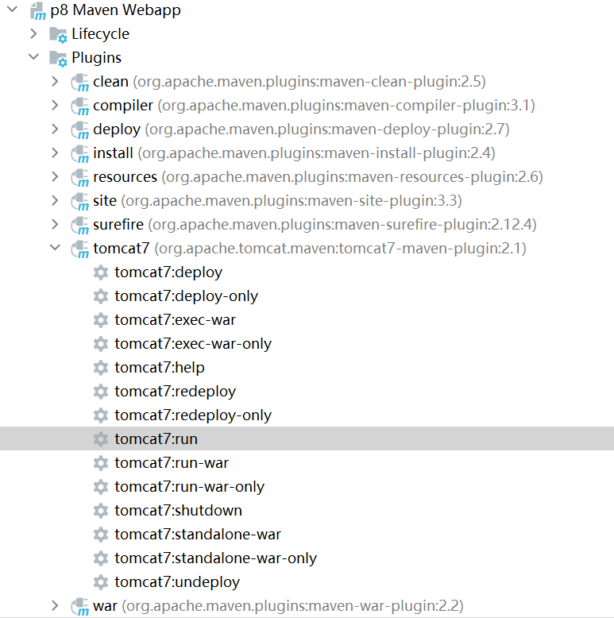

5、网站如下

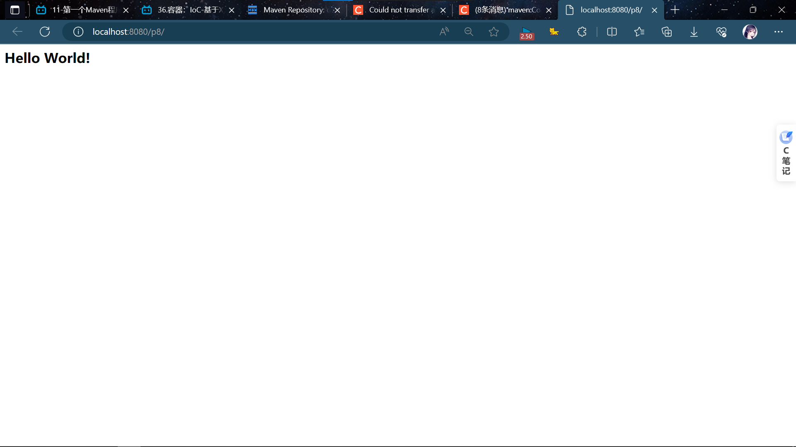

6、如果出错：不能找到xxxxxx

解决：

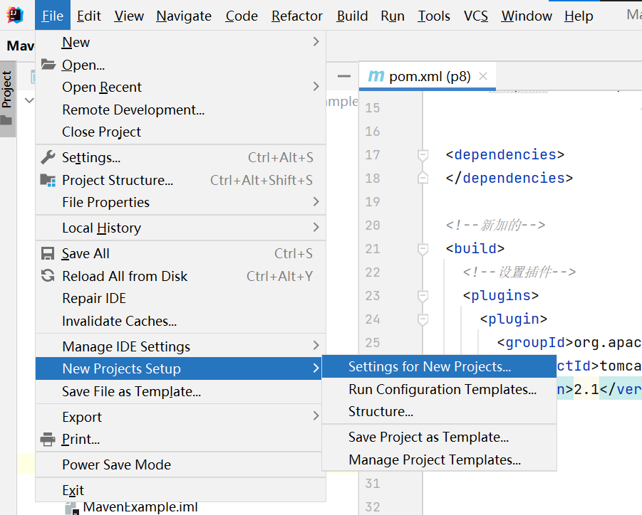

在新项目的settings中，修改importing和runner

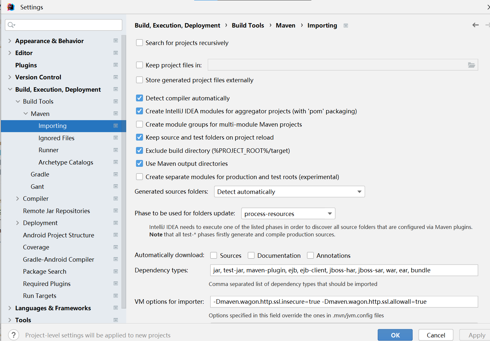

在vm options for importer中加入

```
-Dmaven.wagon.http.ssl.insecure=true -Dmaven.wagon.http.ssl.allowall=true  
```

在runner的VM options中加入

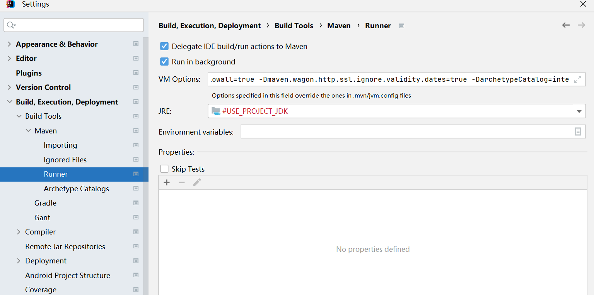

```
-Dmaven.wagon.http.ssl.insecure=true -Dmaven.wagon.http.ssl.allowall=true -Dmaven.wagon.http.ssl.ignore.validity.dates=true -DarchetypeCatalog=internal

```

7、介绍一下pom的结构

```xml
<?xml version="1.0" encoding="UTF-8"?>

<project xmlns="http://maven.apache.org/POM/4.0.0" xmlns:xsi="http://www.w3.org/2001/XMLSchema-instance"
  xsi:schemaLocation="http://maven.apache.org/POM/4.0.0 http://maven.apache.org/xsd/maven-4.0.0.xsd">
  <!--maven版本-->
  <modelVersion>4.0.0</modelVersion>
  <!--组织id-->
  <groupId>org.example</groupId>
  <!--项目id-->
  <artifactId>p8</artifactId>
  <!--版本id，snapshot为开发板，release为完成版-->
  <version>1.0-SNAPSHOT</version>
  <!--打包方式-->
  <packaging>war</packaging>
  <!--依赖-->
  <dependencies>
  </dependencies>

  <!--新加的-->
  <build>
    <!--设置插件-->
    <plugins>
      <plugin>
        <groupId>org.apache.tomcat.maven</groupId>
        <artifactId>tomcat7-maven-plugin</artifactId>
        <version>2.1</version>
      </plugin>
    </plugins>
  </build>
  
</project>
```


# 8、依赖（jar包）管理

## 1、依赖配置

含义：**依赖是当前项目运行所需要的jar包**，一个项目可以设置多个依赖

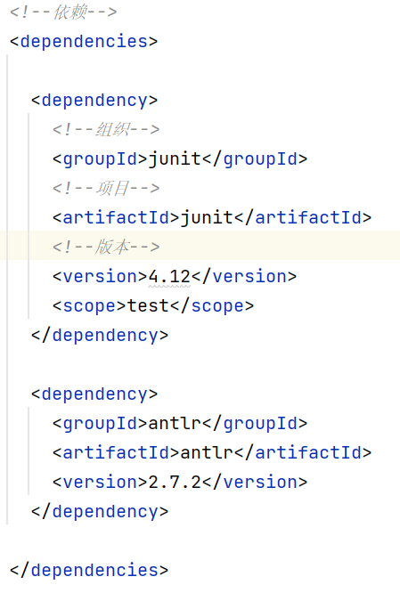


## 2、依赖传递

模块A**直接依赖**于模块/包B，模块/包B直接依赖于模块/包C

我们称模块A**间接依赖**于模块/包C，对于A来说，C是可以正常使用的，这个就叫传递性

所以依赖分为2种：

- 直接依赖
- 间接依赖

比如某天我们不想要A去依赖C了，想要掐断C进入A，需要在A的pom文件中对引入B 的代码进行修改，注意切断C的时候可以不输入C的版本号：

```xml
<dependency>
    <groupId>B</groupId>
    <artifactId>B</artifactId>
    <version>1</version>
    <exclusions>
        <exclusion>
            <groupId>C</groupId>
            <artifactId>C</artifactId>
        </exclusion>
    </exclusions>
</dependency>
```

## 3、依赖的范围

< scope>标签，用来设置该依赖的范围

- 主代码：在main中可以使用
- 测试代码：在test中可使用
- 打包：打包为jar包之后包不包含这个依赖

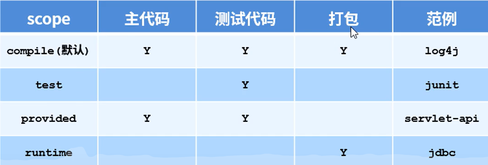

# 9、生命周期与插件

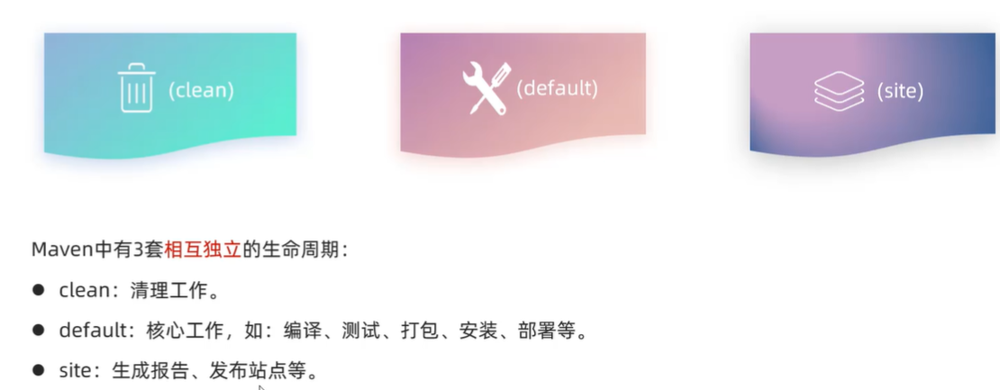

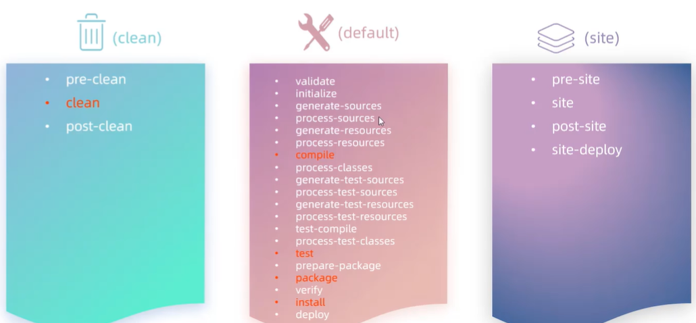

我们只关注下面五个阶段：

- clean：清除上一次构建产生的文件，比如target文件夹会被删去
- compile：对项目代码进行编译，会生成target文件夹
- test：会运行test下面的所有的单元测试
- package：打包操作，把项目打包成jar包，然后放入target文件夹
- install：把打好的jar包放入本地仓库

注意：运行同一周期某个阶段的时候，他的前一阶段也会运行。比如运行install，则前面的compile，test等都会运行，但是clean不会运行，因为他们不是一个周期。

运行：双击Lifecycle中对应的按钮

跳过阶段：比如我现在进行package操作，但是我不想再test了，可以点击test，然后点击“蓝色闪电”按钮，表示跳过test

生命周期和插件（Plugins）的关系：其实生命周期就是靠这些插件来运行的


# 10、分模块开发

好处：方便

做法：比如要将controller包分出来，需要先重新建立一个工程，然后把controller包原封不动拖进去，然后把新工程的三要素作为依赖加入到原先的工程中。**注意，在启动之前，还需要对新工程进行install操作，即将新工程的jar安到本地仓库，不然原来的工程会报错。**


# 11、聚合

问题：如下图，上面的三个工程都依赖于pojo，如果某一条把pojo的内容改了，则上面三个也要跟着改，太麻烦，我们希望他们可以自动更改

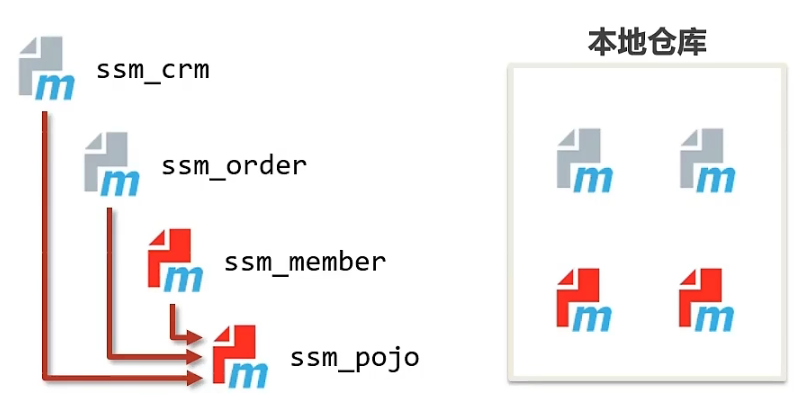

解决：

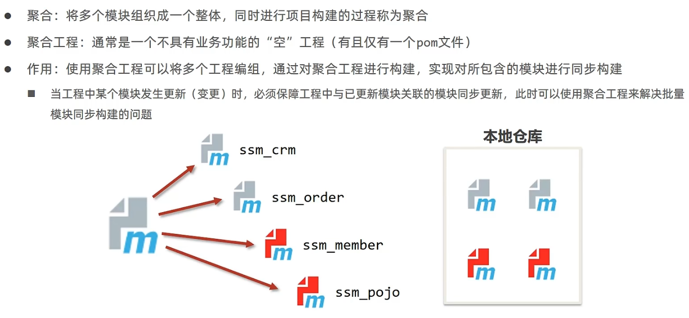

如下图：01为管理的工程，我们需要将其打包方式改为pom，然后在下面写出其管理的工程即可

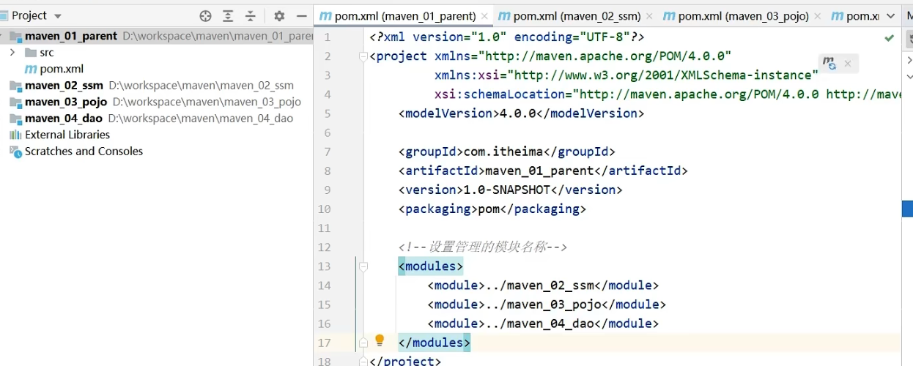

# 12、继承

概念：继承描述的是两个工程之间的关系，与java中的类似，子工程可以继承父工程中的配置信息，常用于简化开发。**继承和聚合常常是一起使用的，聚合中的管理工程常常被作为父工程。**

在上图的02中，写入几句话（如下图）

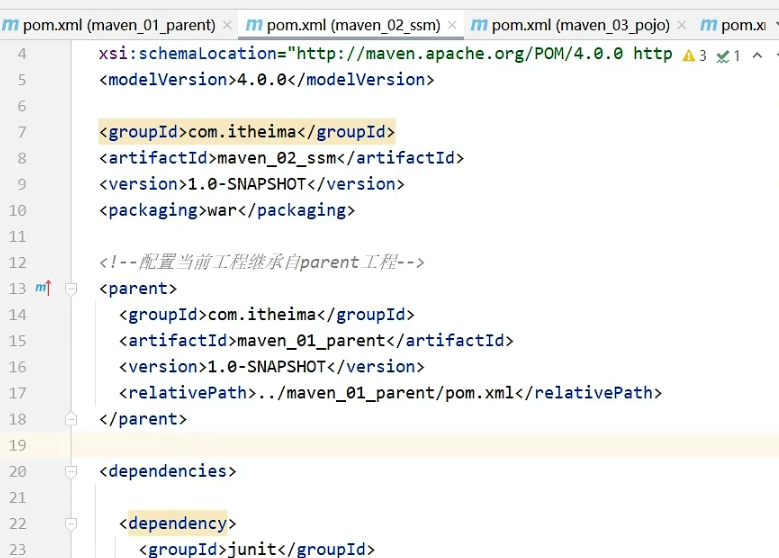

则，此时此刻，02工程将可以使用01的所有的依赖

# 13、版本问题

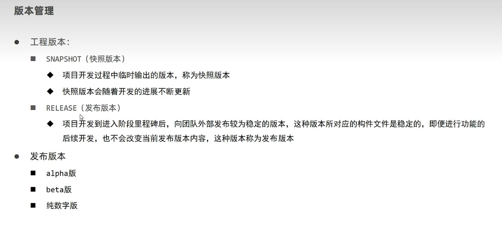

# 14、配置多环境

在父工程的pom中

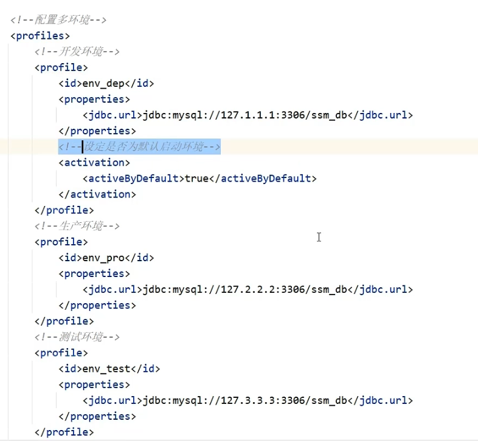


# 16、私服

私服中的仓库分为三种

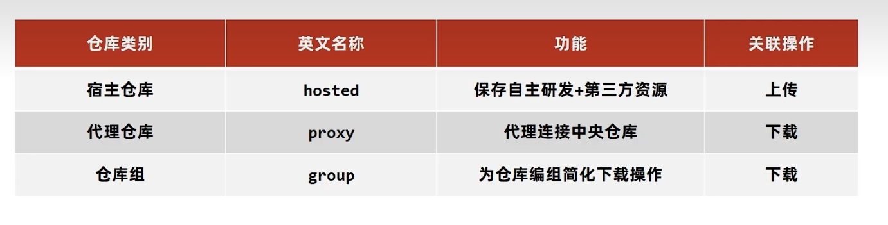

还有私服的上传与下载操作。
