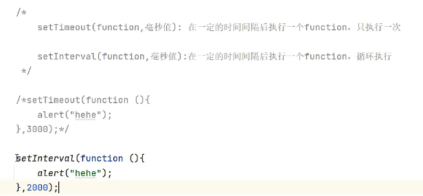
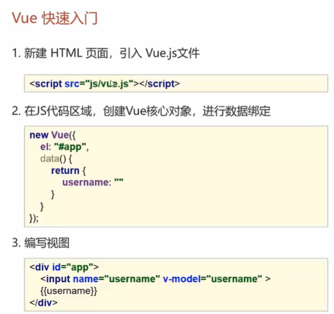
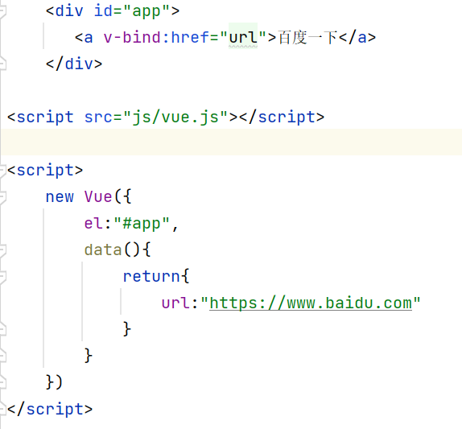

# 1、javaweb简介

是用java技术来解决相关web互联网领域的技术栈，就是用java做网站

组成：浏览器、javaweb程序、数据库


# 2、数据库

略

（补充）事务：一组数据库操作命令，其要么同时被执行，要么同时不被执行，是一个不可分割的逻辑单元


# 3、JDBC

## 1、简介

是用java语言操作关系型数据库的一套API。因为操作不同的关系型数据库需要不同的代码，太麻烦，因而sun公司推出了jdbc，可以用同一套代码处理所有的关系型数据库。


## 2、快速入门

1、新建一个工程

2、在src的同级目录下新建目录lib，将mysql的驱动jar（E盘下的mysql里面有备份）放里面（这两步在后面可以使用maven的依赖管理来做，就不用到处找jar包了）


3、右击jar包，选择“add as lib ”，在里面选项目或者模块范围即可

4、写代码

```java
package com.yzy;

import java.sql.Connection;
import java.sql.DriverManager;
import java.sql.Statement;

public class JDBCdemo {
    public static void main(String[] args) throws Exception {
        //1.注册驱动
        Class.forName("com.mysql.jdbc.Driver");

        //2.获取连接
        String url = "jdbc:mysql://127.0.0.1:3306/db1";//后面加“？键值对1&键值对2……”
        String username = "root";
        String password = "111111";
        Connection connection = DriverManager.getConnection(url,username,password);

        //3.定义sql
        String  sql = "update account set money = 2000 where id = 1";

        //4.获取执行sql的对象Statement
        Statement stmt = connection.createStatement();

        //5.执行sql
        int count = stmt.executeUpdate(sql);//count为受影响的行数

        //6.处理结果
        System.out.println(count);

        //7.释放资源
        stmt.close();
        connection.close();
    }
}
```

5、检查数据库发现确实修改了


## 3、JDBC五大 API 详解

1、DriverManager，驱动管理类，有两个作用：注册驱动与获取数据库连接

2、Connection，连接对象，有两个作用：获取执行sql的对象和管理事务


```java
Statement stmt = connection.createStatement();
        try {
            //开启事务
            connection.setAutoCommit(false);
            String  sql1 = "update account set money = 1000 where id = 1";
            String  sql2 = "update account set money = 2000 where id = 2";

            int count1 = stmt.executeUpdate(sql1);
            int count2 = stmt.executeUpdate(sql2);

            System.out.println(count1);
            System.out.println(count2);
            //成功，提交事务
            connection.commit();
        } catch (SQLException e) {
            //出错，回滚
            connection.rollback();
            throw new RuntimeException(e);
        }
```

3、Statement，提供了两个方法


4、ResultSet，结构集对象，有两个函数


- next（）方法：调用该方法光标将向下移动一行，且判断该行是否有效

使用：

```
while(resultSet.next()){
            list.add(resultSet.getInt("id"));
        }
```

注意：在使用完成后，还需要将resultSet释放掉


5、PreparedStatement

为了解决sql注入问题：举个例子，登录时，我们在后端建立的查询语句为

```
select * from user where username = '这里是用户输入的用户名' and password = '这里是用户输入的密码';
```

现在有一个人，他输入的用户名为乱写的asdadfa，输入的密码为' or '1'='1，即实际使用的sql为

```
select * from user where username = 'asdadfa' and password = '' or '1'='1';
```

这句话必能查出来结果，所以该用户在没有密码的情况下便登录了，本质是字符串的拼接问题。

使用PreparedStatement解决如下：


该类实际上是将sql转义了。

另外，PreparedStatement还有一个功能，即预编译SQL语句，之前的方法每次提交sql都需要检查语法，编译再运行，有了预编译SQL后，在传入SQL语句时即进行了编译，之后传参和执行将会快速很多。总而言之该类可以提升查询速度，但是预编译功能默认是关闭的，手动开启需要在数据库的url后面加“useServerPrepStmts=true”。


## 4、数据库连接池

是一个容器，里面放着数据库连接。（传统做法是来一个用户就开一个连接，用完再销毁，这样太耗费资源了）。因而现在提前make许多连接，需要的时候直接在里面取，不用了放回去。

有许多数据库连接池，今天学习Druid，是阿里开源的，是java语言最好的数据库连接池之一。

使用步骤：
1.导入jar包：将druid-1.0.9.jar放入lib中（备份在mysql文件夹下）

2.定义配置文件

在src下面建立文件cruid.properties


```
driverClassName=com.mysql.jdbc.Driver
url=jdbc:mysql://127.0.0.1:3306/db1
username=root
password=111111
#初始化连接数量
initialSize=5
#最大连接数
maxActive=10
#最大等待时间
maxWait=3000
```

3.加载配置文件

4.获取数据库连接池对象

5.获取连接

下面为例子：

```java
import com.alibaba.druid.pool.DruidDataSourceFactory;

import javax.sql.DataSource;
import java.io.FileInputStream;
import java.io.FileNotFoundException;
import java.io.IOException;
import java.sql.Connection;
import java.util.Properties;

public class DruidDemo {
    public static void main(String[] args) throws Exception {
        //1.导入jar包
        //2.定义配置文件
        //3.加载配置文件
        Properties prop = new Properties();
        prop.load(new FileInputStream("E:\\IDEA\\project\\jdbcExample\\src\\cruid.properties"));
        //4.获取数据库连接池对象
        DataSource dataSource = DruidDataSourceFactory.createDataSource(prop);
        //5.从池中获取连接
        Connection connection = dataSource.getConnection();
        //得到连接后与之前相同的配置即可
    }
}

```


# 4、Maven

是一个项目管理工具

三大功能：

- 标准化的项目结构
- 标准化的构建流程（一键编译、打包）
- 好用的依赖管理：不用到处去找jar包


# 5、MyBatis

## 1、简介

javaEE是企业级java，有三层框架

- 表现层：负责页面展示的代码
- 业务层：负责业务处理的代码
- 持久层：负责与数据库处理的代码

MyBatis是一款持久层框架，是对JDBC的简化。

## 2、快速入门（基本开发）

1、创建user表，添加数据，为了查询user的all信息，且写类User


2、创建模块，导入坐标

在项目的pom.xml中加入如下依赖

```xml
<dependencies>
   
        <!--mybatis依赖-->
        <dependency>
            <groupId>org.mybatis</groupId>
            <artifactId>mybatis</artifactId>
            <version>3.5.6</version>
        </dependency>
    
        <!--mysql驱动-->
        <dependency>
            <groupId>mysql</groupId>
            <artifactId>mysql-connector-java</artifactId>
            <version>8.0.17</version>
        </dependency>
    
        <!--单元测试-->
        <dependency>
            <groupId>junit</groupId>
            <artifactId>junit</artifactId>
            <version>4.12</version>
            <scope>test</scope>
        </dependency>
    
    </dependencies>
```

3、编写MyBatis核心配置文件（替换连接信息，解决硬编码问题）

在src/main/resources目录下面新建文件mybatis-config.xml

```xml
<?xml version="1.0" encoding="UTF-8" ?>
<!DOCTYPE configuration
        PUBLIC "-//mybatis.org//DTD Config 3.0//EN"
        "https://mybatis.org/dtd/mybatis-3-config.dtd">
<configuration>
    <environments default="development">
        <environment id="development">
            <transactionManager type="JDBC"/>
            <dataSource type="POOLED">
                <!--数据库连接信息：这里不加时间信息会出错-->
                <property name="driver" value="com.mysql.jdbc.Driver"/>
                <property name="url" value="jdbc:mysql://127.0.0.1:3306/db1?serverTimezone=UTC"/>
                <property name="username" value="root"/>
                <property name="password" value="111111"/>
            </dataSource>
        </environment>
    </environments>
    <!--这里加载sql映射文件的位置-->
    <mappers>
        <mapper resource="xxx/xxx/UserMapper.xml"/>
    </mappers>
</configuration>
```

4、编写SQL映射文件（统一管理sql语句，解决硬编码问题）

在src/main/resources目录下面新建文件UserMapper.xml（对哪个表操作第一个单词就写谁，这里对User表操作）

```xml
<?xml version="1.0" encoding="UTF-8" ?>
<!DOCTYPE mapper
        PUBLIC "-//mybatis.org//DTD Mapper 3.0//EN"
        "https://mybatis.org/dtd/mybatis-3-mapper.dtd">
<!--namespace为名称空间-->
<mapper namespace="test">
    
    <!--id为该sql语句的唯一标识-->
    <!--后面的为返回类型，这里应该为User-->
    <select id="selectAll" resultType="com.itheima.User">
        select user_name as name,user_password as password from User;
    </select>

</mapper>
```

5、编码（定义类;

加载核心配置文件，获取SqlSessionFactory对象;

获取SqlSession对象，执行sql语句;

释放资源）

新建一个MyBatisDemo类，写入：

```java
import org.apache.ibatis.io.Resources;
import org.apache.ibatis.session.SqlSession;
import org.apache.ibatis.session.SqlSessionFactory;
import org.apache.ibatis.session.SqlSessionFactoryBuilder;

import java.io.IOException;
import java.io.InputStream;
import java.util.List;

public class MyBatisDemo {
    public static void main(String[] args) throws Exception {
        //1.加载mybatis的核心配置文件，获取SqlSessionFactory
        String resource = "mybatis-config.xml";
        InputStream inputStream = Resources.getResourceAsStream(resource);
        SqlSessionFactory sqlSessionFactory = new SqlSessionFactoryBuilder().build(inputStream);


        //2.获取SqlSession对象，用其来执行sq语句
        SqlSession sqlSession = sqlSessionFactory.openSession();


        //3.执行sql(传入名称空间.标识)
        List<User> users = sqlSession.selectList("test.selectAll");
        System.out.println(users);


        //4.释放资源
        sqlSession.close();

    }
}
```

6、额外

IDEA是个很强大的工具，可以帮你检查sql语法，但前提是需要连接数据库。


这时的IDEA也相当于一个navicat。

## 3、Mapper代理开发（企业多使用）

传统开发

```java
SqlSession sqlSession = sqlSessionFactory.openSession();
List<User> users = sqlSession.selectList("test.selectAll");
```

还是很麻烦，有硬编码。使用Mapper代理开发解决这个问题

1、定义与SQL映射文件同名的Mapper接口，并且将Mapper接口和SQL映射文件放在同一目录下

在com.mapper下建立接口


在resources中建立目录com/mapper（注意一定要是/）

把UserMapper拖进去


2、设置SQL映射文件的namespace更改为Mapper接口的全限定名（包名+类名）


3、在Mapper接口中定义方法，方法名就是SQL映射文件中sql语句的id，并保持参数类型和返回值类型一致

```java
import com.itheima.User;
import java.util.List;

public interface UserMapper {
    List<User> selectAll();
    User selectById(int id);//这时，sql文件中的语句应该为：select * from User where id = #{id}
    //{}中的id要和接口中传入的名称一致
}

```

注意修改MyBatis核心配置文件中的mapper的位置（直接写文件名.xml即可）

4、编码：通过SqlSession的getMapper方法获取Mapper接口的代理对象

5、编码：调用相对应的方法完成sql执行

```java
import com.itheima.User;
import org.apache.ibatis.io.Resources;
import org.apache.ibatis.session.SqlSession;
import org.apache.ibatis.session.SqlSessionFactory;
import org.apache.ibatis.session.SqlSessionFactoryBuilder;

import java.io.InputStream;
import java.util.List;

public class MyBatisDemo2 {
    public static void main(String[] args) throws Exception {
        //1.加载mybatis的核心配置文件，获取SqlSessionFactory
        String resource = "mybatis-config.xml";
        InputStream inputStream = Resources.getResourceAsStream(resource);
        SqlSessionFactory sqlSessionFactory = new SqlSessionFactoryBuilder().build(inputStream);


        //2.获取SqlSession对象，用其来执行sq语句
        SqlSession sqlSession = sqlSessionFactory.openSession();


        //3.通过SqlSession的getMapper方法获取Mapper接口的代理对象
        UserMapper userMapper = sqlSession.getMapper(UserMapper.class);
        List<User> users = userMapper.selectAll();
        System.out.println(users);


        //4.释放资源
        sqlSession.close();

    }
}
```

## 4、介绍MyBatis核心配置文件

- environment标签：可以配置数据库的信息，在environments中可以配置多个数据库，通过environments的default属性来切换

## 5、实际业务流程

- 写mapper接口
- 使用mybatisx生成配置文件信息
- 在上面两个过程中，要考虑业务的输入和输出


**注意**：如果java中封装的实体的属性和数据库中实体的属性的名称不一样，则查询出来的对象是有问题的，因而我们在查询时需要给其起别名，用as，使得数据库属性名称和实体达到一致。

## 6、案例——多条件查询

对于多条件查询，其接口中方法的书写可以有多种形式，下面三种形式的sql文件是一致的

1.散装参数查询：注解中的名称 应该和配置文件中的#{}中的名称一致

```java
List<User> selectByCondition(@Param("id")int id,@Param("name")String name);
```

2.对象参数查询

```java
List<User> selectByCondition(User user);
```

3.map集合参数：map的键的名称应该和配置文件中的#{}中的量一致

```java
List<User> selectByCondition(Map map);
```

## 7、案例——动态条件查询

比如有三个筛选条件，但用户只输入了其中的一个

需要改造sql语句：先判断输入是不是空，不是才会执行语句

这里使用了标签技术

```sql
select *
from User
where 
	1=1
	<if test="id != null">
		and id=#{id}
	</if>
	
	<if test="name != null">
		and name=#{name}
	</if>
	
	<if test="age != null">
		and age=#{age}
	</if>;
```

## 8、案例——添加

在接口中写入

```java
void add(User user)
```

SQL写入：注意#中的名称应该和对象中的一致

```xml
<insert id="add">
	insert into User(user_name,user_age)
	values(#{name},#{age});
</insert>
```

注意，执行完接口中的方法后需要手动提交

```java
sqlSession.commit();
```

## 9、案例——添加后需要返回新加入的记录的主键值

只需要sql改为

```xml
<insert id="add" useGeneratedKeys="true" keyProperty="id">
	insert into User(user_name,user_age)
	values(#{name},#{age});
</insert>
```

在java中调用对象的getId（）方法即可获得id

## 10、案例——修改全部字段

在接口中写入：返回值是更新的行数

```java
int update(User user)
```

SQL写入：注意#中的名称应该和对象中的一致

```xml
<update id="update">
	update User
    set
    	user_name=#{name},
    	user_age=#{age}
    where id=#{id};
</update>
```

注意，执行完接口中的方法后需要手动提交

```java
sqlSession.commit();
```

## 11、案例——修改部分字段

SQL写入：注意#中的名称应该和对象中的一致

```xml
<update id="update">
	update User
    <set>
        <if test="name != null ">
            user_name=#{name},
    	</if>
    	<if test="age != null">
            user_age=#{age}
    	</if>
    </set>
    
    where id=#{id};
</update>
```

## 12、案例——删除一个

在接口中写入

```java
void deleteById(int id)
```

SQL写入：注意#中的名称应该和对象中的一致

```xml
<delete id="deleteById">
	delete from User
    where id = #{id};
</delete>
```

注意，执行完接口中的方法后需要手动提交

```java
sqlSession.commit();
```

## 13、案例——批量删除

在接口中写入

```java
void deleteByIds（@Param("ids") int[] ids）
```

SQL写入：注意#中的名称应该和对象中的一致

```xml
<delete id="deleteByIds">
	delete from User where id
    in(
    	<foreach collection="ids" item="id" separator=",">
            #{id}
    	</foreach>
    );
</delete>
```

注意，执行完接口中的方法后需要手动提交

```java
sqlSession.commit();
```


## 14、重大优化

后面做项目的时候可能需要在多个类中进行sql操作，因而下面的代码会在多个类中重复出现

```java
 String resource = "mybatis-config.xml";
 InputStream inputStream = Resources.getResourceAsStream(resource);
 SqlSessionFactory sqlSessionFactory = new SqlSessionFactoryBuilder().build(inputStream);
```

改造如下：

1、建包util

2、建类SqlSessionFactoryUtils

```java
package com.itheima.util;

import org.apache.ibatis.io.Resources;
import org.apache.ibatis.session.SqlSessionFactory;
import org.apache.ibatis.session.SqlSessionFactoryBuilder;

import java.io.IOException;
import java.io.InputStream;

public class SqlSessionFactoryUtils {
    private static SqlSessionFactory sqlSessionFactory;
    static {
        try {
            String resource = "mybatis-config.xml";
            InputStream inputStream = Resources.getResourceAsStream(resource);
            sqlSessionFactory = new SqlSessionFactoryBuilder().build(inputStream);
        } catch (IOException e) {
            throw new RuntimeException(e);
        }


    }
    public static SqlSessionFactory getSqlSessionFactory(){
        return sqlSessionFactory;

    }
}

```

3、将原来的三行代码改为

```java
SqlSessionFactory sqlSessionFactory = SqlSessionFactoryUtils.getSqlSessionFactory();
```


# 6、HTML

网页的W3C标准：

- 结构：HTML
- 表现：CSS
- 行为：JavaScript 

## 1、快速入门

```html
<html>
    <head>
        <title>这是一个html的快速入门案例</title>
    </head>
    <body>
        hello,world
    </body>
</html>
```


## 2、基本标签

- < h1> xxx < /h1>：定义一级标题
- < h6> xxx < /h6>：定义六级标题
- < font face="楷体" size="5" color="#ffc0cb">xxx< /font>：定义字体
- < b>xxxx< /b>：定义粗体
- < i>xxxx< /i>：定义斜体
- < u>xxxx< /u>：定义下划线
- < center>xxx< /center>：将文本居中
- < p>xxxx< /p>：这将是一个段落
- < br>：放在文字后面，表示换行
- < hr>：一条水平线

## 3、图片、音频、视频标签


```

......
```

src这里建议使用相对路径，./表示当前目录下

## 4、超链接

< a>xxxxxxx< /a>


## 5、列表 


## 6、表格

- < table>< /table>：定义表格
- < tr>< /tr>：定义行
- < td>< /td>：定义单元格，td有两个属性，rowspan和colspan，用于合并单元格，其值大小表示在行上和列上各合并了几个单元格
- < th>< /th>：定义表头单元格

table的border使得每个单元格的四周有一圈宽度为1的线

cellspacing使得单元格之间的空白去掉

tr中的align使得该行中的每个单元格的内容都居中


## 7、表单

< form>xxxxx< /form>

form有两个属性值：

（1）action：指定表单数据提交的URL，一般用完整路径（项目名/servlet名）

（2）method：指定表单提交的方式：

- get，是默认值，需要提交的数据将拼接在URL后面，且URL的长度有限制4Kb
- post，需要提交的数据将会在http请求协议的请求体中，且请求参数的个数无限

## 8、表单项标签

1、< select>xxx< /select>：定义下拉列表，< option>xxx< /option>定义列表项目，放在xxx中，想要提交数据也要加name字段，如果option加了value字段，则提交value，否则默认提交option包裹的内容

2、< textarea>为文本域


3、< input>：通过type控制输入形式，下为type的取值，没有< /input>；name字段为提交后的引用名称

- text，为默认值，定义单行的输入字段，在这种情况下常常还需要定义name属性，表示该值
- password，定义密码字段，与text的不同在于其显示秘文，在这种情况下常常还需要定义name属性，表示该值
- radio定义单选按钮，一个radio是一个小圆圈，要让两个达到互斥的效果，设置其name相同即可，且radio下切记还要添加value字段，这样提交时其提交的为value字段的内容
- checkbox定义复选框，每个checkbox都是一个小方块，记得让这几个的那么相同，添加value字段
- file定义文件上传按钮
- hidden定义隐藏的输入字段
- submit定义提交按钮，点击将会把表单数据发给server，搭配value字段可以修改按钮里的文字
- reset，点击将重置表单中的所有数据
- button，定义可点击的按钮，value可以修改按钮内的文字


# 7、CSS

全称为：层叠样式表，用来控制html表现的样式，比如控制html字体的颜色等

```
内联方式：在标签内部使用style属性，属性值是CSS属性键值对
```

```
内部样式：定义<style>标签，在其内定义CSS样式
```

```
外部样式：单独写一个css文件，在html中使用link标签进行引入
```


# 8、JavaScript 

作用：控制网页行为，使得网页可以交互，js代码与java无关系，但其代码风格类似（每行代码后的;可以写也可以不写）

## 1、引入方式

- 内部脚本：在HTML代码中，写< script>< /script>标签，将js代码写在其中，可以在html的任意位置存放任意数目的标签，但一般都放在body的结尾
- 外部脚本：写一个js文件，进行引入

## 2、输出语句


## 3、变量与数据类型

用var定义的变量是全局变量，且建议使用驼峰命名法

```
var test=20;
test="xjtu";
```


## 4、流程控制

与java相同

## 5、函数


## 6、对象1——Array

定义：


访问：


特点：其是变长与变类型的，即可以字符串与数字共存，虽然定义了三个，但是也可以突然填入10的位置为20

## 7、对象2——String

定义：


## 8、对象3——自定义对象

定义：


调用：对象名称.属性/方法

## 9、对象4——BOM对象

浏览器对象模型，有好几个：Window Navigator Screen History Location

### 9.1Windows


confirm有返回值，点击确定返回true，点击取消返回false



### 9.2History


### 9.3Location


## 10、对象5——DOM对象

为图片按钮文本等设置id值

使用document.getElementById等方法可以获取该对象，从而对其进行操作


## 11、事件监听

推荐使用第二种


这里的onclick即为事件，js代码提供了丰富的事件供人们选择。


# 9、web核心

JavaWeb技术栈：常用b/s模式。

服务器端的资源：

- 静态资源：html，css，javascript
- 动态资源：Servlet，JSP
- 数据库

http请求报文分为get请求和post请求

- get：有请求行和请求头。请求信息放在请求头里面
- post：有请求行、请求头、请求体。请求信息放在请求体里面

http响应报文


# 10、Web服务器

Tomcat是一个应用软件，对HTTP的协议进行封装，使得程序员不必直接对协议进行操作，使得web开发更为便捷。**本质上是一个启动web服务的工具**。

双击tomcat中bin目录下的startup.bat，可以启动tomcat。

项目部署：将项目整体（一般都放项目的war包）放到webapps下面即部署上了。


## 1、IDEA创建web项目

使用**模板**创建

模板是没有java目录和resources目录的，需要自己加

将pom.xml中无用的删掉，结果如下


## 2、IDEA集成Tomcat

本来需要把war包放在tomcat的目录下面，现在可以使用IDEA进行集成，不用放了就

```xml
 <!--新加的-->
  <build>
    <!--设置插件-->
    <plugins>
      <plugin>
        <groupId>org.apache.tomcat.maven</groupId>
        <artifactId>tomcat7-maven-plugin</artifactId>
        <version>2.1</version>
      </plugin>
    </plugins>
  </build>
```

点击tomcat下的run可以运行该web项目。


## 3、Servlet

简介：是Java提供的**动态web资源**开发技术


### 3.1快速入门

1、创建web项目，在pom中导入Servlet依赖坐标

```xml
  <dependencies>
    <dependency>
      <groupId>javax.servlet</groupId>
      <artifactId>javax.servlet-api</artifactId>
      <version>3.1.0</version>
      <scope>provided</scope>
    </dependency>
  </dependencies>
```

2、创建一个类，实现Servlet接口，且重写接口中的all方法，在service方法（最重要）中写东西

3、配置：在这个类上使用@WebServlet注解，配置该Servlet的访问路径

```java
package com.itheima.web;//在main的java下面

import javax.servlet.*;
import javax.servlet.annotation.WebServlet;
import java.io.IOException;

@WebServlet("/demo1")
public class ServletDemo1 implements Servlet {
    //初始化方法，当第一次访问该对象时，其会自动执行，该方法只会执行一次，因为对象只可被创建一次
    public void init(ServletConfig servletConfig) throws ServletException {

    }

    public ServletConfig getServletConfig() {
        return null;
    }

    //我们只关注这个方法，当该类被访问时，这个方法会自动执行；且每次访问都会执行
    public void service(ServletRequest servletRequest, ServletResponse servletResponse) throws ServletException, IOException {
        System.out.println("hello world wky");

    }

    public String getServletInfo() {
        return null;
    }
    
    //服务器关闭时，其会调用，这时对象要被销毁，只可调用一次
    public void destroy() {

    }
}

```

4、访问：启动Tomcat。浏览器访问URL

运行，在控制台发现输出的语句，证明正确


### 3.2流程

Servlet对象是由Tomcat Web服务器创建的，service方法也是由Tomcat Web服务器调用的

当第一次访问Servlet类时，会自动创建对象，此后再访问将不再重新创建。


### 3.3HttpServlet类

http请求分为get和post两种，其参数放置的位置不同，因而对于service方法来说，需要进行分类处理。在此，我们提出解决方法：借用HttpServlet类，用之替换之前的Servlet类，重写HttpServlet中的doGet和doPost方法，当收到get请求时将调用doGet方法，收到post请求时将调用doPost方法。

注：doGet和doPost传入的参数req和resp其实就是Servlet接口中service方法的两个参数

```java
import javax.servlet.ServletException;
import javax.servlet.annotation.WebServlet;
import javax.servlet.http.HttpServlet;
import javax.servlet.http.HttpServletRequest;
import javax.servlet.http.HttpServletResponse;
import java.io.IOException;

@WebServlet("/demo2")
public class ServletDemo2 extends HttpServlet {
    @Override
    protected void doGet(HttpServletRequest req, HttpServletResponse resp) throws ServletException, IOException {

    }

    @Override
    protected void doPost(HttpServletRequest req, HttpServletResponse resp) throws ServletException, IOException {

    }
}

```


### 3.4访问路径urlPattern


注意：谁的路径更具体用谁的，比如精确匹配可能会和目录匹配冲突，实际上将使用精确匹配


### 3.5学习Request对象

对于方法的学习：


**下面这个用的多**：Request可以获取参数：在使用这种通用的方法后，doGet方法和doPost方法的内容实际上就一样了，故可以直接在doPost中写上  this.doGet(req,resp);


如果表单中输入的为中文，可能会出现**乱码问题**，解决如下：

- 解决post乱码，在doGet方法的第一行加一句request.setCharacterEncoding("UTF-8")
- 解决get乱码


**请求转发**


### 3.6学习Response对象

Response设置响应数据的**方法**：


**字符数据**：html等文本


**字节数据**：视频音频图片等


**重定向**

这里的资源路径的名称需要在前面加上项目名称（即请求转发不需要加项目名称，但重定向需要加）


# 11、JSP

- 概念：java服务端页面，是一种动态的网页技术，既可以定义页面三剑客，也可以定义java，jsp =html + java

- 如果使用原先的技术，Servlet+mybatis，难以展现动态页面，比如一个简单的“张三，欢迎你”，将需要在Servlet的resp中写入大量的html代码，因为html是静态的，为了解决这个问题，提出了JSP。


## 1、快速入门

1、导入JSP坐标

```xml
<dependency>
      <groupId>javax.servlet.jsp</groupId>
      <artifactId>jsp-api</artifactId>
      <version>2.2</version>
      <scope>provided</scope>
</dependency>
```

2、创建JSP文件：在webapp目录下面建立jsp文件

3、编写HTML标签和Java代码

```jsp
<%@ page contentType="text/html;charset=UTF-8" language="java" %>
<html>
<head>
    <title>Title</title>
</head>
<body>
    <h1> hello jsp</h1>
    <%
        System.out.println("hello jsp");
    %>

</body>
</html>

```

4、启动项目，路径为hello.jsp


## 2、原理

一个JSP本质上就是一个Servlet


## 3、脚本介绍

被 <> 包围的即为jsp的脚本，里面写Java代码，有三种类型


第二种会直接在页面打印。


## 4、特点

纯jsp结合java和HTML，劣势很大，因此目前我们使用Servlet和JSP的结合，Servlet负责数据的封装，JSP负责数据的展现，不要直接在jsp中写java代码，使用EL表达式和JSTL替代java代码。


## 5、EL表达式


首先建立一个Servlet类，在其中建立域且传给el-demo.jsp


## 6、JSTL


如果test后的值为true，将会执行。$代表其为EL表达式

 


# 12、MVC三层模式


三层架构


# 13、会话跟踪技术

会话：用户打开浏览器，访问web服务器的资源，则代表会话建立。直到有任何一方断开连接，则会话中断。一次会话中可以包含多次请求和响应。

会话跟踪：服务器需要判断两次请求是否来自于同一个会话，在同一个会话下的多次请求之间应该有联系。 

实现方式：

- 客户端**会话跟踪技术**：Cookie
- 服务器端**会话跟踪技术**：Session

## 1、Cookie

发送Cookie后，浏览器端将会把该Cookie存储

每次请求时，浏览器将会把自己的所有Cookie发往服务器端


使用细节


## 2、Session

使用：


**同一次会话中的session对象一定是同一个，这就保证了会话跟踪。**

使用细节：


# 14、过滤器Filter

是JavaWeb三大组件之一（Servlet、Filter、Listener）。可以把对资源的请求拦截下来，从而实现一些特殊的功能。

## 1、快速入门


## 2、流程


## 3、拦截路径的设置


## 4、过滤器链


# 15、AJAX

之前使用**jsp＋Servlet**，不好用，因而有了AJAX，**HTML+AJAX**为当前的主流技术栈


**原先**：


**现在**：


## 1、快速入门

1、编写AjaxServlet，且使用response输出字符串

```java
import javax.servlet.ServletException;
import javax.servlet.annotation.WebServlet;
import javax.servlet.http.HttpServlet;
import javax.servlet.http.HttpServletRequest;
import javax.servlet.http.HttpServletResponse;
import java.io.IOException;

@WebServlet("/ajaxServlet")
public class AjaxServlet extends HttpServlet {
    @Override
    protected void doGet(HttpServletRequest req, HttpServletResponse resp) throws ServletException, IOException {
        //1.响应数据
        resp.getWriter().write("hello ajax");
    }

    @Override
    protected void doPost(HttpServletRequest req, HttpServletResponse resp) throws ServletException, IOException {
        this.doPost(req, resp);
    }
}

```

2、新建html，创建XMLHttpRequest对象：用于和服务器交换数据

3、向服务器发送请求

4、获取服务器响应数据

```html
<!DOCTYPE html>
<html lang="en">
<head>
    <meta charset="UTF-8">
    <title>Title</title>
</head>
<body>

<script>
    //抄下面这个网站即可
    //https://www.w3school.com.cn/
    //1.创建核心对象
    const xhttp = new XMLHttpRequest();
    //2.发送请求
    xhttp.open("GET", "http://localhost:8080/p3/ajaxServlet", true);
    xhttp.send();
    //3.获取响应
    xhttp.onreadystatechange = function() {
        if (this.readyState == 4 && this.status == 200) {
            alert(this.responseText);
        }
    };

</script>

</body>
</html>
```


## 2、Axios

首先在js目录中引入axios.js文件（副本在E盘的js文件夹中）   

是对AJAX的一种封装，用于简化书写


```html
<!DOCTYPE html>
<html lang="en">
<head>
    <meta charset="UTF-8">
    <title>Title</title>
</head>
<body>
<!--引入文件-->
<script src="js/axios.js"></script>

<script>
    <!--get-->
    axios({
        method:"get",
        url:"http://localhost:8080/p3/ajaxServlet?username=zhangsan"
    }).then(function (resp){
        alert(resp.data);
    })
	<!--post-->
    axios({
        method:"post",
        url:"http://localhost:8080/p3/ajaxServlet",
        data:"username=zhangsan"
    }).then(function (resp){
        alert(resp.data);
    })

</script>

</body>
</html>
```


# 16、Json数据格式

 因其层次鲜明，常用于前后端之间的数据的传输

1、基础语法


2、与对象的转换


3、操作


# 17、Vue

简介：是一个前端框架，简化了前端代码的书写

## 1、快速入门

在webapp目录下面新建js目录，将文件vue.js（E盘的js文件夹中）导入其中



html代码：

```html
<!DOCTYPE html>
<html lang="en">
<head>
    <meta charset="UTF-8">
    <title>Title</title>
</head>
<body>
    <div id="app">
        <input v-model="username">
        <!--插值表达式 -->
        {{username}}
    </div>

<script src="js/vue.js"></script>
<script>
    new Vue({
        el:"#app",
        data(){
            return{
                username:""
            }
        }
    })
</script>

</body>
</html>
```

## 2、常用指令


1、v-bind



2、v-model

常用于输入框的双向绑定


比如上图中，输入框的内容被url绑定，因而点击可以跳转

3、v-on:用于绑定事件


4、v-if家族


上图中，如果count == 3，ze展示div1，如果为2展示div2，否则展示div3

5、v-show：作用同v-if

6、v-for


上图中，addrs为data中的数组

## 3、vue与ajax 的结合

一般，我们在vue的mounted下面写ajax代码。mounted代表页面加载完毕，完毕后即可调用方法向查询数据


# 18、Element

概述：是饿了么公司开发的基于Vue的组件库。**用来使得页面好看**

## 1、快速入门

1.首先在js文件夹中的lin-master文件夹复制到webapp下面

2.引入资源

3.写vue

4.超element网站的代码，不用哪个删哪个

```html
<!DOCTYPE html>
<html lang="en">
<head>
    <meta charset="UTF-8">
    <title>Title</title>
</head>
<body>
<div id="app">
    <!--这里直接复制element的核心代码-->
    <el-row>
        <el-button>默认按钮</el-button>
        <el-button type="primary">主要按钮</el-button>
        <el-button type="success">成功按钮</el-button>
        <el-button type="info">信息按钮</el-button>
        <el-button type="warning">警告按钮</el-button>
        <el-button type="danger">危险按钮</el-button>
    </el-row>

    <el-row>
        <el-button plain>朴素按钮</el-button>
        <el-button type="primary" plain>主要按钮</el-button>
        <el-button type="success" plain>成功按钮</el-button>
        <el-button type="info" plain>信息按钮</el-button>
        <el-button type="warning" plain>警告按钮</el-button>
        <el-button type="danger" plain>危险按钮</el-button>
    </el-row>

    <el-row>
        <el-button round>圆角按钮</el-button>
        <el-button type="primary" round>主要按钮</el-button>
        <el-button type="success" round>成功按钮</el-button>
        <el-button type="info" round>信息按钮</el-button>
        <el-button type="warning" round>警告按钮</el-button>
        <el-button type="danger" round>危险按钮</el-button>
    </el-row>

    <el-row>
        <el-button icon="el-icon-search" circle></el-button>
        <el-button type="primary" icon="el-icon-edit" circle></el-button>
        <el-button type="success" icon="el-icon-check" circle></el-button>
        <el-button type="info" icon="el-icon-message" circle></el-button>
        <el-button type="warning" icon="el-icon-star-off" circle></el-button>
        <el-button type="danger" icon="el-icon-delete" circle></el-button>
    </el-row>

</div>
<!--引入资源-->
<script src="js/vue.js"></script>
<script src="lib-master/index.js" charset="utf-8"></script>
<link rel="stylesheet" href="lib-master/theme-chalk/index.css"/>
<!--写vue-->
<script>
    new Vue({
        el:"#app"
    })
</script>


</body>
</html>
```

## 2、Element布局


抄的时候，style应该放head里面；其他还是放div里面；还有一些放new Vue里面


# 19、综合案例

## 1、简介

有一个品牌与公司表，希望可以实现以下功能

- 查询所有
- 新增品牌
- 修改品牌
- 删除品牌
- 批量删除
- 分页查询
- 条件查询

## 2、准备

数据库：提前导入数据

src的目录结构如下：


pom.xml如下

```xml
<?xml version="1.0" encoding="UTF-8"?>

<project xmlns="http://maven.apache.org/POM/4.0.0" xmlns:xsi="http://www.w3.org/2001/XMLSchema-instance"
         xsi:schemaLocation="http://maven.apache.org/POM/4.0.0 http://maven.apache.org/xsd/maven-4.0.0.xsd">
  <modelVersion>4.0.0</modelVersion>

  <groupId>org.example</groupId>
  <artifactId>brandcase</artifactId>
  <version>1.0-SNAPSHOT</version>
  <packaging>war</packaging>

  <dependencies>

    <!--mybatis依赖-->
    <dependency>
      <groupId>org.mybatis</groupId>
      <artifactId>mybatis</artifactId>
      <version>3.5.6</version>
    </dependency>

    <!--mysql驱动-->
    <dependency>
      <groupId>mysql</groupId>
      <artifactId>mysql-connector-java</artifactId>
      <version>8.0.17</version>
    </dependency>

    <!--单元测试-->
    <dependency>
      <groupId>junit</groupId>
      <artifactId>junit</artifactId>
      <version>4.12</version>
      <scope>test</scope>
    </dependency>

    <!--servlet-->
    <dependency>
      <groupId>javax.servlet</groupId>
      <artifactId>javax.servlet-api</artifactId>
      <version>3.1.0</version>
      <scope>provided</scope>
    </dependency>
      
       <!--json工具-->
    <dependency>
      <groupId>com.alibaba</groupId>
      <artifactId>fastjson</artifactId>
      <version>1.2.62</version>
    </dependency>

  </dependencies>
  <!--新加的-->
  <build>
    <!--设置插件-->
    <plugins>
      <plugin>
        <groupId>org.apache.tomcat.maven</groupId>
        <artifactId>tomcat7-maven-plugin</artifactId>
        <version>2.1</version>
      </plugin>
    </plugins>
  </build>

</project>

```

webapp的目录结构如下


在resources下面建立文件mybatis-config.xml

```xml
<?xml version="1.0" encoding="UTF-8" ?>
<!DOCTYPE configuration
        PUBLIC "-//mybatis.org//DTD Config 3.0//EN"
        "https://mybatis.org/dtd/mybatis-3-config.dtd">
<configuration>
    <environments default="development">
        <environment id="development">
            <transactionManager type="JDBC"/>
            <dataSource type="POOLED">
                <!--数据库连接信息：这里不加时间信息会出错-->
                <property name="driver" value="com.mysql.jdbc.Driver"/>
                <property name="url" value="jdbc:mysql://127.0.0.1:3306/db1?serverTimezone=UTC"/>
                <property name="username" value="root"/>
                <property name="password" value="111111"/>
            </dataSource>
        </environment>
    </environments>
    <!--这里加载sql映射文件的位置-->
    <mappers>
        <mapper resource="mapper/BrandMapper.xml"/>
    </mappers>
</configuration>
```

在mapper下面建立接口BrandMapper

在resources目录的mapper下面新建文件BrandMapper.xml，这个文件的目录要和接口一样

```xml
<?xml version="1.0" encoding="UTF-8" ?>
<!DOCTYPE mapper
        PUBLIC "-//mybatis.org//DTD Mapper 3.0//EN"
        "https://mybatis.org/dtd/mybatis-3-mapper.dtd">
<!--namespace为名称空间,为接口的包名+类名-->
<mapper namespace="mapper.BrandMapper">
    
    
</mapper>
```

util包中有类SqlSessionFactoryUtils

```java
package util;

import org.apache.ibatis.io.Resources;
import org.apache.ibatis.session.SqlSessionFactory;
import org.apache.ibatis.session.SqlSessionFactoryBuilder;

import java.io.IOException;
import java.io.InputStream;

public class SqlSessionFactoryUtils {
    private static SqlSessionFactory sqlSessionFactory;
    static {
        try {
            String resource = "mybatis-config.xml";
            InputStream inputStream = Resources.getResourceAsStream(resource);
            sqlSessionFactory = new SqlSessionFactoryBuilder().build(inputStream);
        } catch (IOException e) {
            throw new RuntimeException(e);
        }

    }
    public static SqlSessionFactory getSqlSessionFactory(){
        return sqlSessionFactory;

    }
}

```

## 3、查询所有

先在pojo中建立Brand类

```java
package pojo;

public class Brand {
    // id 主键
    private Integer id;
    // 品牌名称
    private String brandName;
    // 企业名称
    private String companyName;
    // 排序字段
    private Integer ordered;
    // 描述信息
    private String description;
    // 状态：0：禁用  1：启用
    private Integer status;


    public Integer getId() {
        return id;
    }

    public void setId(Integer id) {
        this.id = id;
    }

    public String getBrandName() {
        return brandName;
    }

    public void setBrandName(String brandName) {
        this.brandName = brandName;
    }

    public String getCompanyName() {
        return companyName;
    }

    public void setCompanyName(String companyName) {
        this.companyName = companyName;
    }

    public Integer getOrdered() {
        return ordered;
    }

    public void setOrdered(Integer ordered) {
        this.ordered = ordered;
    }

    public String getDescription() {
        return description;
    }

    public void setDescription(String description) {
        this.description = description;
    }

    public Integer getStatus() {
        return status;
    }
    //逻辑视图
    public String getStatusStr(){
        if (status == null){
            return "未知";
        }
        return status == 0 ? "禁用":"启用";
    }

    public void setStatus(Integer status) {
        this.status = status;
    }

    @Override
    public String toString() {
        return "Brand{" +
                "id=" + id +
                ", brandName='" + brandName + '\'' +
                ", companyName='" + companyName + '\'' +
                ", ordered=" + ordered +
                ", description='" + description + '\'' +
                ", status=" + status +
                '}';
    }
}
```

在BrandMapper接口中写

```java
List<Brand> selectAll();
```

在BrandMapper.xml中写

```xml
<select id="selectAll" resultType="pojo.Brand">
        select id,brand_name as brandName,company_name as companyName,ordered,description,status from tb_brand;
</select>
```

在service中创建接口BrandService，写入

```java
List<Brand> selectAll();
```

在service中创建包impl，在其中创建BrandService的实现类名称为BrandServiceImpl

```java
package service.impl;

import mapper.BrandMapper;
import org.apache.ibatis.session.SqlSession;
import org.apache.ibatis.session.SqlSessionFactory;
import pojo.Brand;
import service.BrandService;
import util.SqlSessionFactoryUtils;

import java.util.List;

public class BrandServiceImpl implements BrandService {
    //1.获取SqlSessionFactory
    SqlSessionFactory sqlSessionFactory = SqlSessionFactoryUtils.getSqlSessionFactory();
    
    @Override
    public List<Brand> selectAll() {
        //2.获取SqlSession对象，用其来执行sq语句
        SqlSession sqlSession = sqlSessionFactory.openSession();

        //3.通过SqlSession的getMapper方法获取Mapper接口的代理对象
        BrandMapper brandMapper = sqlSession.getMapper(BrandMapper.class);
        List<Brand> brands = brandMapper.selectAll();

        //4.释放资源
        sqlSession.close();
        return brands;
    }
    
}
```

在web下面建立类SelectAllServlet，写入

```java
package web;

import com.alibaba.fastjson.JSON;
import pojo.Brand;
import service.BrandService;
import service.impl.BrandServiceImpl;

import javax.servlet.ServletException;
import javax.servlet.annotation.WebServlet;
import javax.servlet.http.HttpServlet;
import javax.servlet.http.HttpServletRequest;
import javax.servlet.http.HttpServletResponse;
import java.io.IOException;
import java.util.List;

@WebServlet("/selectAllServlet")
public class SelectAllServlet extends HttpServlet {
    private BrandService brandService = new BrandServiceImpl();
    @Override
    protected void doGet(HttpServletRequest req, HttpServletResponse resp) throws ServletException, IOException {
        //1.调用service的方法
        List<Brand> brands = brandService.selectAll();
        //2.将数据转为json
        String jsonString = JSON.toJSONString(brands);
        //3.写数据
        resp.setContentType("text/json;charset=utf-8");
        resp.getWriter().write(jsonString);

    }

    @Override
    protected void doPost(HttpServletRequest req, HttpServletResponse resp) throws ServletException, IOException {
        this.doGet(req, resp);
    }
}

```

浏览器打开selectAllServlet，有数据表示测试正确

接下来写前端，在Vue中加入代码，使得前端界面一加载完成就从后端得到数据

```java
mounted(){
            var _this = this;
            //加载完成
            axios({
                method:"get",
                url:"http://localhost:8080/brandcase/selectAllServlet"
            }).then(function (resp){
                _this.tableData=resp.data;
            })
        }
```


## 4、新增

在BrandMapper接口中写

```java
void add(Brand brand);
```

在BrandMapper.xml接口中写

```xml
<insert id="add">
        insert into tb_brand(brand_name,company_name,ordered,description,status)
        values(#{brandName},#{companyName},#{ordered},#{description},#{status});
</insert>
```

在BrandService中加入

```java
void add(Brand brand);
```

在BrandServiceImpl中加入

```java
@Override
    public void add(Brand brand) {
        //2.获取SqlSession对象，用其来执行sq语句
        SqlSession sqlSession = sqlSessionFactory.openSession();

        //3.通过SqlSession的getMapper方法获取Mapper接口的代理对象
        BrandMapper brandMapper = sqlSession.getMapper(BrandMapper.class);
        brandMapper.add(brand);

        //4.提交且释放资源
        sqlSession.commit();
        sqlSession.close();
    }
```

新建AddServlet

```java
package web;

import com.alibaba.fastjson.JSON;
import pojo.Brand;
import service.BrandService;
import service.impl.BrandServiceImpl;

import javax.servlet.ServletException;
import javax.servlet.annotation.WebServlet;
import javax.servlet.http.HttpServlet;
import javax.servlet.http.HttpServletRequest;
import javax.servlet.http.HttpServletResponse;
import java.io.BufferedReader;
import java.io.IOException;


@WebServlet("/addServlet")
public class AddServlet extends HttpServlet {
    private BrandService brandService = new BrandServiceImpl();
    @Override
    protected void doGet(HttpServletRequest req, HttpServletResponse resp) throws ServletException, IOException {
        //解决乱码问题
        req.setCharacterEncoding("UTF-8");
        //1.接收前端传来的json数据
        BufferedReader br = req.getReader();
        String params = br.readLine();

        //2.转为Brand对象
        Brand brand = JSON.parseObject(params, Brand.class);

        //3.添加
        brandService.add(brand);
        
        //4.响应成功标识
        resp.getWriter().write("success");
    }

    @Override
    protected void doPost(HttpServletRequest req, HttpServletResponse resp) throws ServletException, IOException {
        this.doGet(req, resp);
    }
}
```

前端界面的提交按钮上绑定了点击事件，一旦点击，将运行方法addBrand()

```java
addBrand(){
                var _this = this;
                //加载完成
                axios({
                    method:"post",
                    url:"http://localhost:8080/brandcase/addServlet",
                    data:_this.brand
                }).then(function (resp){
                    if(resp.data == "success"){
                        //关闭窗口
                        _this.dialogVisible = false;
                        //查询all，新建的方法
                        _this.selectAll();
                        //弹窗，来自element
                        _this.$message({
                            showClose: true,
                            message: '添加成功',
                            type: 'success'
                        });
                    }
                })
            },
```


## 5、servlet改进

每次一个方法都要对应一个servlet，太麻烦，对此进行**改进如下**：

建立一个BaseServlet

```java
package web;

import javax.servlet.ServletException;
import javax.servlet.http.HttpServlet;
import javax.servlet.http.HttpServletRequest;
import javax.servlet.http.HttpServletResponse;
import java.io.IOException;
import java.lang.reflect.InvocationTargetException;
import java.lang.reflect.Method;

public class BaseServlet extends HttpServlet {
    @Override
    protected void service(HttpServletRequest req, HttpServletResponse resp) throws ServletException, IOException {
        //1.获取请求路径
        String uri = req.getRequestURI();
        //2.获取最后一段路径，方法名
        int index = uri.lastIndexOf('/');
        String methodName = uri.substring(index + 1);
        //3.执行方法
        //3.1获取执行的对象
        Class<? extends BaseServlet> cls = this.getClass();
        //3.2获取方法对象
        Method method = null;
        try {
            method = cls.getMethod(methodName, HttpServletRequest.class, HttpServletResponse.class);
            method.invoke(this, req, resp);
        } catch (NoSuchMethodException e) {
            throw new RuntimeException(e);
        } catch (InvocationTargetException e) {
            throw new RuntimeException(e);
        } catch (IllegalAccessException e) {
            throw new RuntimeException(e);
        }

    }
}
```

每个表都只对应一个Servlet，因而我们建立一个BrandServlet，并将之前的selectAll和add加进去

```java
package web;

import com.alibaba.fastjson.JSON;
import pojo.Brand;
import service.BrandService;
import service.impl.BrandServiceImpl;

import javax.servlet.ServletException;
import javax.servlet.annotation.WebServlet;
import javax.servlet.http.HttpServletRequest;
import javax.servlet.http.HttpServletResponse;
import java.io.BufferedReader;
import java.io.IOException;
import java.util.List;

@WebServlet("/brand/*")
public class BrandServlet extends BaseServlet{
    
    private BrandService brandService = new BrandServiceImpl();

    public void selectAll(HttpServletRequest req, HttpServletResponse resp) throws ServletException, IOException{
        //1.调用service的方法
        List<Brand> brands = brandService.selectAll();
        //2.将数据转为json
        String jsonString = JSON.toJSONString(brands);
        //3.写数据
        resp.setContentType("text/json;charset=utf-8");
        resp.getWriter().write(jsonString);
    }
    
    public void add(HttpServletRequest req, HttpServletResponse resp) throws ServletException, IOException{
        //解决乱码问题
        req.setCharacterEncoding("UTF-8");
        //1.接收前端传来的json数据
        BufferedReader br = req.getReader();
        String params = br.readLine();

        //2.转为Brand对象
        Brand brand = JSON.parseObject(params, Brand.class);

        //3.添加
        brandService.add(brand);

        //4.响应成功标识
        resp.getWriter().write("success");
    }
}

```

另外，在前端中的每一个地址都要用/brand/*来进行访问


## 6、批量删除

BrandMapper中写入

```java
void deleteByIds(@Param("ids") int[] ids);
```

BrandMapper.xml中写入（动态sql）

```xml
<delete id="deleteByIds">
        delete from tb_brand where id
        in(
        <foreach collection="ids" item="id" separator=",">
            #{id}
        </foreach>
        );
</delete>
```

BrandService中

```java
void deleteBuIds(int[] ids);
```

BrandServiceImpl中

```java
public void deleteBuIds(int[] ids) {
        //2.获取SqlSession对象，用其来执行sq语句
        SqlSession sqlSession = sqlSessionFactory.openSession();

        //3.通过SqlSession的getMapper方法获取Mapper接口的代理对象
        BrandMapper brandMapper = sqlSession.getMapper(BrandMapper.class);
        brandMapper.deleteByIds(ids);

        //4.提交且释放资源
        sqlSession.commit();
        sqlSession.close();
    }
```

BrandServlet

```java
public void deleteByIds(HttpServletRequest req, HttpServletResponse resp) throws ServletException, IOException{
        //解决乱码问题
        req.setCharacterEncoding("UTF-8");
        //1.接收前端传来的json数据[1,2,3,4,5]
        BufferedReader br = req.getReader();
        String params = br.readLine();

        //2.转为数组
        int[] ids = JSON.parseObject(params, int[].class);

        //3.添加
        brandService.deleteByIds(ids);

        //4.响应成功标识
        resp.getWriter().write("success");
    }
```

前端中，给批量删除按键绑定上方法如下

```java
deleteByIds(){
                //console.log(this.multipleSelection);
                // {
                //     "brandName": "小米",
                //     "companyName": "小米科技有限公司",
                //     "description": "are you ok",
                //     "id": 2,
                //     "ordered": 50,
                //     "status": 1,
                //     "statusStr": "启用"
                // }
                //发现复选框对应的方法中的multipleSelection即为信息
                //1.在data创建id数组selecedIds
                for (let i = 0; i < this.multipleSelection.length; i++) {
                    let selectElement = this.multipleSelection[i];
                    this.selectedIds[i] = selectElement.id;
                }
                //2.发送ajax请求
                var _this = this;
                axios({
                    method:"post",
                    url:"http://localhost:8080/brandcase/brand/deleteByIds",
                    data:_this.selectedIds
                }).then(function (resp){
                    if(resp.data == "success"){
                        //查询all
                        _this.selectAll();
                        //弹窗
                        _this.$message({
                            showClose: true,
                            message: '删除成功',
                            type: 'success'
                        });
                    }
                })

            }
```
