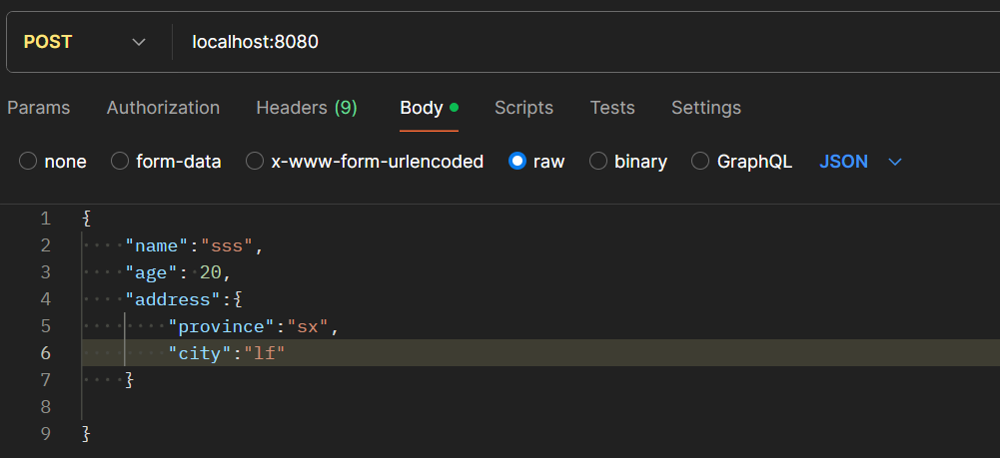
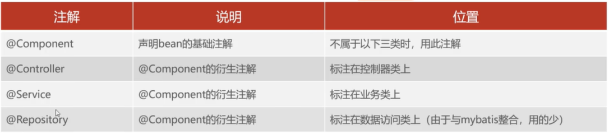
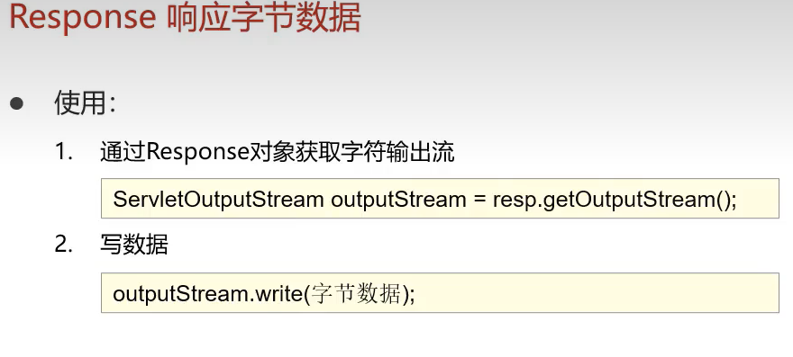

#  1、javaweb简介

是用java技术来解决相关web互联网领域的技术栈，就是用java做网站

注意：前端服务器的返回是没有数据的，只有url地址，需要浏览器自己去向后端服务器请求这些url。

下面这种图属于“前后端分离开发”，其实还有一种开发叫“前后端组合开发”。目前大多数都是


# 2、数据库

## 2.1、基本

```dos
命令行启动数据库
net start mysql
命令行关闭数据库
net stop mysql
```

```
连接（登录）数据库，本地数据库不需要写后面2个参数，默认127.0.0.1和3309
mysql -u用户名 -p密码 [-h数据库服务器IP -P端口号]
登出数据库
exit
```

```
SQL语句以;结尾
-- 单行注释（注意有个空格）
# 单行注释（注意有个空格）
/*多行注释*/
```


3个阶段：

- 数据库设计：先设计好数据库（外键、范式等），然后使用DDL进行创建
- 数据库操作：java程序员使用DML和DQL进行增删改查
- 数据库优化：使用索引等对数据库进行优化

## 2.2、数据库设计

### 2.2.1、设计

表之间的关系有三种：

- 一对多：班级（一）和学生（多），一个班级可以有多个学生，一个学生只能属于一个班级。在实现上，可以使用外键进行实现。
- 一对一：用户和身份证，亦比如一个人的信息分为基础信息和扩展信息，我们可以建2张表，这两张表之间就是一对一的关系。在实现上，可以在一个表中添加一个外键，关联另一个表的主键，且把这个外键设置为unique。（为啥要拆开建呢？因为可能对基础信息的查询远多于扩展信息的查询，拆开可以提升效率）
- 多对多：学生和课程，一个学生可以上多个课程，一个课程也可以有多个学生。在实现上，一般会借用中间表和2个外键帮助实现，如下图：


接下来介绍一下**外键**：比如现在的职员有一个部门ID，然后另外有个部门表，里面部门ID是**主键**，这种情况下我们称职员表里的部门ID为“外键”。分类：如果我们手动使用foreign key命令来关联这两个字段，这个外键我们称为“**物理外键**”；如果不使用foreign key命令，而是我认为他们之间确实有关系，这个外键我们称为“**逻辑外键**”。

不少企业都严禁使用“物理外键”，实际开发中，外键一般都使用“逻辑外键”。

注意：这里和我们的范式不冲突，范式的核心在于尽量减少一个表中的依赖，就是把大表拆开，拆开之后的小表之间有关系，我们需要使用外键将他们关联起来，在这里我们选取逻辑外键就好啦~


### 2.2.2、DDL

```sql
-- 创建数据库，如果没有后面的exists，创建同名数据库会报错
create database [if not exists] 数据库名;
-- 删除数据库
drop database [if exists] 数据库名;
-- 查看当前有哪些数据库
show databases;
-- 查看当前工作数据库
select database();
-- 切换工作数据库
use 数据库名;
```

```sql
create table 表名 (
    字段名 数据类型 [约束] [约束] [comment 'xxx'],
    字段名 数据类型 [约束] [约束] [comment 'xxx'],
    字段名 数据类型 [约束] [约束] [comment 'xxx']
) [comment 'xxx'];
```


举个例子：（auto_increment是一个关键字，用来实现id自增）

```sql
create table user (
    id int primary key auto_increment comment 'ID',
    username varchar(20) unique not null comment '用户名',
    name varchar(10) not null comment '姓名',
    age int comment '年龄',
    gender char(1) default '男' comment '性别'
) comment '用户表';
```

数据类型（整数、小数、字符串、日期时间）

|   类型    | 字节 |             说明              |
| :-------: | :--: | :---------------------------: |
|  tinyint  |  1   | 无符号形式为tinyint unsigned  |
| smallint  |  2   | 无符号形式为tinyint smallint  |
| mediumint |  3   | 无符号形式为tinyint mediumint |
|    int    |  4   |    无符号形式为tinyint int    |
|  bigint   |  8   |  无符号形式为tinyint bigint   |

|  类型   | 字节 |                         说明                         |
| :-----: | :--: | :--------------------------------------------------: |
|  float  |  4   |           float(5,2)，表示总共5位，小数2位           |
| double  |  8   |          double(5,2)，表示总共5位，小数2位           |
| decimal |      | decimal(5,2)，表示总共5位，小数2位（和钱有关用这个） |

|  类型   |                             说明                             |
| :-----: | :----------------------------------------------------------: |
| varchar | 变长。varchar(10)表示最多存10个字符，不足10个按照实际存储。性能一般，但是省空间。最大字节数65535B |
|  char   | 定长。char(10)表示最多存10个字符，不足10个也按10个字符存。性能好，但是不省空间。最大字节数255B |

|   类型   |                  范围                   |        说明         |
| :------: | :-------------------------------------: | :-----------------: |
|   date   |          1000-01-01~9999-12-31          |     yyyy-mm-dd      |
|   time   |          -838:59:59~838:59:59           |      hh:mm:ss       |
| datetime | 1000-01-01 00:00:00~9999-12-31 23:59:59 | yyyy-mm-dd hh:mm:ss |

```sql
-- 删除表
drop table [if exists] 表名;
-- 展示当前数据库的所有表
show tables;
-- 查看表结构
desc 表名;
-- 查看建表语句
show create table 表名;
-- 还可以对表的字段进行增删改查，但这一部分不用掌握，图像化界面可以搞定
```

## 2.3、数据库操作

### 2.3.1、DML增删改

```sql
-- 添加时，字符串和日期时间类型要包在''或者""中，可以使用now()函数获得当前的日期时间
-- 单条，指定字段
insert into 表名(字段1,字段2) values(值1,值2);
-- 单条，所有字段
insert into 表名 values(值1,值2);
-- 多条，指定字段
insert into 表名(字段1,字段2) values(值1,值2),(值1,值2);
-- 多条，所有字段
insert into 表名 values(值1,值2),(值1,值2);
```

```sql
delete from 表名 [where 条件];
```

```sql
update 表名 set 字段1=值1,字段2=值2 [where 条件];
```

### 2.3.2、DQL单表查询

```sql
select [distinct] 字段1 [as 别名1],字段2 [as 别名2]
from 表名
where 条件
group by 对where得到的结果进行分组，这是分组的字段
having 分组后还需要进行筛选，这是筛选条件
order by 排序的字段
limit 分页参数
```

对where行的详细解释：


```sql
select * from book where id <= 5;
select * from book where author is null;
-- 下面两句话等效，ba语句是两端闭的
select * from book where date >= '2000-01-01' and date <= '2024-01-01';
select * from book where date between '2000-01-01' and  '2024-01-01';
-- 下面两句话等效
select * from book where author_id in (1,2,3);
select * from book where author_id = 1 or author_id = 2 or author_id = 3;
-- 查询作者叫"王--"
select * from book where author_name like '王__';
-- 查询作者姓王
select * from book where author_name like '王%';
```

下面对聚合函数进行解释：把一列数据当成整体，对这一列数据进行操作

```sql
count() -- null值不会统计，这里推荐使用count(*)，底层有优化
max()
min()
avg()
sum()
-- 下面的语句查询了最小的生日，也就是年级最大的人
select min(birthday) from user
```

对group by 和 having的详细解释：

```sql
-- 男女分组，分别得到人数
-- select后面只能写分组字段和聚合函数
select gender,count(*) from user group by gender;
-- 查询生日在'2005-01-01'之前的员工，按照职位进行分类，获取员工数>2的职位
-- 执行顺序：where->group和聚合函数->having，where后面不可跟聚合函数，having后面可以跟聚合函数
select job,count(*) from user where birthday < '2005-01-01' group by job having count(*) > 2;
```

对order by行的详细解释：asc是升序，desc是降序，啥都不写默认是升序

```sql
-- 啥都不写，默认按birthday升序
select * from user order by birthday;
-- birthday降序
select * from user order by birthday asc;
-- 先按照birthday降序，如果birthday一样，那么按照id升序
select * from user order by birthday desc, id asc;
```

对limit的详细解释：（这个属于方言，不同数据库使用的语言不一样）

```sql
-- 从第0条开始（含），展示5条
select * from user limit 0,5
-- 从第3条开始（含），展示9条
select * from user limit 3,9

-- 下面假设每页展示的数目固定，是5条
-- 第1页
select * from user limit 0,5
-- 第2页
select * from user limit 5,5
-- 第3页
select * from user limit 10,5
-- 第n页
select * from user limit (n-1)*5,5
```

### 2.3.3、DQL多表查询

```sql
-- 下面的这行代码，将返回这两个表的笛卡尔积。比如a表有5条数据，b有4条数据，那么将返回5×4=20条数据，这就叫笛卡尔积。
select * from table_a,table_b;
-- 我们可以通过where条件筛选出想要的信息
select * from table_a,table_b where table_a.col1 = table_b.col2;
```

多表查询分类：


```sql
-- 显式内连接
select * from book inner join category on book.category_id = category.category_id;
-- 隐式内连接
select * from book,category where book.category_id = category.category_id;
-- 内连接注意事项：只有book.category_id 和 category.category_id 确实一样才能留下来，有一方是null或者没有匹配上都不可以留下来。
```

```sql
-- 左外连接
-- 首先会把内连接的部分保留下来，然后book中的剩余部分也全部保留
select * from book letf [outer] join category on book.category_id = category.category_id;

-- 右外连接
-- 首先会把内连接的部分保留下来，然后category中的剩余部分也全部保留
select * from book right [outer] join category on book.category_id = category.category_id;

-- 内外连接其实可以相互转化，所以我们一般使用左连接就可以了
-- 连接之后如果还有筛选条件，需要在后面再加where语句，比如内连接之后，还需要得到价格大于20的书，那么语句变为select a.*,b.category_name from book a inner join category b on a.category_id = b.category_id where a.price > 20;  或者  select * from book, category where book.category_id = category.category_id and book.price > 20;
-- 如果还需要分组，在where后面再加group by即可
-- 多对多关系有两个外键，所以会涉及到三张表的连接，select * from A,B,C where A.col1 = B.col1 and B.col2 = C.col2;
```

举个例子：

book表如下：


category表如下：


内连接：


左外连接：


右外连接：


```sql
-- 标量子查询，子查询返回一个值，在这里子查询返回科技类的id，然后在book中查询科技类的书
select * from book where book.category_id = (select category_id from category where category_name = '科技');
-- 列子查询，子查询返回一列，在这里子查询返回科技类和文学类的ids，然后在book中查询科技类和文学类的书
select * from book where book.category_id in (select category_id from category where category_name = '科技' or category_name = '文学');
-- 行子查询，子查询返回一行，下面查询和西游记这本书的category_id和price都一样的书的信息
select * from book where (book.category_id, book.price) = (select category_id,price form book where book.name = '西游记');
-- 表子查询，子查询返回一个表，常作为临时表来使用,这里先查出来book中价格大于20的书，然后将它作为a表，和category表进行内连接，得到这些书的类别信息
select a.*,b.category_name from (select * from book where price > 20) a inner join category b on a.category_id = b.category_id;
```

## 2.4、数据库优化

### 2.4.1、事务

定义：一组操作的集合，这些操作要么同时成功，要么同时失败，不能执行一半然后后面的失败。

```sql
-- 语法
start transaction;
sql1;
sql2;
commit;
rollback;
-- 使用：先开启事务；然后执行两条sql；如果成功执行commit；如果失败执行rollback
```

事务的四大特性：ACID

- 原子性：不可再分，要么all成功，要么all失败
- 一致性：事务完成时，不管成功还是失败，数据都是一致的
- 隔离性：事务之间是独立的。可以这么理解，开启事务的时候，会把数据复制一份，假设称为copy1，事务的所有操作在copy1上执行，如果成功（运行commit），copy1再返给源数据，如果失败则copy1丢弃。所以，在事务运行过程中，在源数据上看不到任何变化。
- 持久性：事务成功或者回滚，对数据的改变是持久的

### 2.4.2、索引

**我们首先需要明确一点：索引对于表查询效率的提升是巨大的**

优点：

- 提升查询效率
- 通过索引对数据进行排序，可以降低排序成本

缺点：

- 索引会消耗空间
- 索引会降低增删改操作的效率（因为要维护树结构）

原理（示意图）：


原理（实际）：红黑树这些二叉的，树的高度太高，不利于查询，B+树矮胖矮胖的


```sql
-- 创建索引
create index 索引名 on 表名(字段名);
-- 删除索引
drop index 索引名 on 表名;
```

注意：

- 系统默认给主键创建索引，主键索引，效率是最高的
- 对于有unique约束的字段，其本质就是唯一索引


# 3、HTML

W3C组织（万维网联盟）制定的网页标准有三个部分（可以在网站w3school上学习）：

- HTML：元素
- CSS：颜色、大小样式等
- JavaScript ：交互


## 3.1、快速入门

- 关键字不区分大小写
- 单引号和双引号不分 

```html
<html>
    <head>
        <title>这是一个html的快速入门案例</title>
    </head>
    <body>
        hello,world
    </body>
</html>
```


## 3.2、基本标签

```html
<!-- 定义一级标题 -->
<h1> xxx </h1>
<!-- 定义六级标题 -->
<h6> xxx </h6>
<!-- 定义字体 -->
<font face="楷体" size="5" color="#ffc0cb">xxx</font>
<!-- 定义粗体 -->
<b>xxxx</b>
<!-- 定义斜体 -->
<i>xxxx</i>
<!-- 定义下划线 -->
<u>xxxx</u>
<!-- 将文本居中 -->
<center>xxx</center>
<!-- 这将是一个段落 -->
<p>这是一段话</p>
<!-- 放在文字后面，表示换行 -->
<br>
<!-- 一条水平线 -->  
<hr>

<!-- 这是没有任何语义的标签 为了和css这些打配合，一行可以写多个，宽高由内容撑开，不可以设置-->
<span>xxx</span>
<!-- 这是没有任何语义的标签 为了和css这些打配合，一行只能写一个，宽度默认是父元素宽度，高度由内容撑开，可以手动设置宽高-->
<div>xxx</div>

```

## 3.3、图片、音频、视频标签

```html

```

- src这里建议使用相对路径，./表示当前目录下，../表示上一级目录
- 宽度和高度这里写的是像素高度，如果同时指定可能导致图片大小变形，一般指定其中的一个，另一个会自动比例缩放
- 高端宽度也可以使用10%等表示相对于父元素的大小

```html
<!--下面是视频标签，controls是加载播放组件必须写-->
<video src="xxx" controls width="100px"></video>
<!--下面是音频标签，controls是加载播放组件必须写-->
<audio src="xxx" controls></audio>
```

## 3.4、超链接


## 3.5、列表 


## 3.6、表格

```html
<!--border是边框，边框1px width是整个表格的宽度 cellspacing="0"是cell和cell直接的间隙=0-->
<table border="1px" cellspacing="0" width="600px">
    <!--tr是行-->
    <tr>
        <!--th是表头-->
        <th>序号</th>
        <th>品牌</th>
        <th>名称</th>
        <th>企业名称</th>
    </tr>
    <!--align是把cell内容居中展示-->
    <tr align="center">
        <!--td是单元格-->
        <td>1</td>
        <td></td>
        <td>huawei</td>
        <td>华为技术有限公司</td>
    </tr>
    <tr align="center">
        <td>2</td>
        <td></td>
        <td>阿里</td>
        <td>阿里巴巴有限公司</td>
    </tr>
</table>
```


## 3.7、表单

```html
<!--action：指定表单数据提交的URL，一般用完整路径（项目名/servlet名）-->
<!--method：指定表单提交的方式：get和post，如果不写默认get-->
	<!--get，是默认值，需要提交的数据将拼接在URL后面，且URL的长度有限制4Kb-->
	<!--post，需要提交的数据将会在http请求协议的请求体中，且请求参数的个数无限-->
<form action="" method="get">
    <!--text类型表示是一个输入框，username是传入值的引用-->
    用户名:<input type="text" name="username">
    年龄:<input type="text" name="age">
    <!--submit类型表示是个提交按钮，点击提交后会送到url处，value是按钮上面显示的字-->
    <input type="submit" value="提交"></input>
</form>
```


下面详细讲一下**表单项**3：（但是表单项也不用必须放在form中 单独用也是可以的）

```html
<!--通过type控制输入形式，下为type的取值，没有</input>,name字段为提交后的引用名称-->
<input type="" name="">

性别：<input type="radio" name="gender" value="1">男
     <input type="radio" name="gender" value="2">女

性别：<input type="checkbox" name="gender" value="1">男
     <input type="checkbox" name="gender" value="2">女
     <input type="checkbox" name="gender" value="3">未知

图像<input type="file" name="image"></input>

<input type="submit" value="提交"></input>
<input type="reset" value="重置"></input>
<input type="button" value="按钮"></input>
```

- text为默认值，定义单行的输入字段，在这种情况下常常还需要定义name属性，表示该值的引用
- password定义密码字段，与text的不同在于其显示秘文，需要name
- radio定义单选按钮，name必须相同，是传值的引用，如果点击男，gender传1，点击女则gender传2


- checkbox定义复选框，name必须相同，是传值的引用


- file定义文件上传按钮，name是引用


- hidden定义隐藏的输入字段
- submit定义提交按钮，点击将会把表单数据发给url，value可以修改按钮内的文字
- reset点击将重置表单中的所有数据，value可以修改按钮内的文字
- button定义可点击的按钮，value可以修改按钮内的文字

```html
<!--下拉列表-->
<!--name是引用 如果选择硕士 那么degree=2-->
<select name="degree">
    <option  value="-1">请选择</option>
    <option  value="0">大专</option>
    <option  value="1">本科</option>
    <option  value="2">硕士</option>
</select>
```

```html
<!--文本域-->
<textarea>
```

## 3.8、页面布局

盒子模型

- content：内容
- border：边框
- padding：边框和内容之间的填充
- margin：边框外面的部分


盒子模型1：

```css
<style>
    div {
        width:200px;
        height: 200px;
        box-sizing: border-box;/*border-box模式，则上面的宽和高都是border之内三件套的*/
        background-color: aqua;/*padding和content是青色*/

        padding: 20px 20px 20px 20px;/*上右下左*/
        border: 10px solid red;/*只能设置一个宽度10px 实线和红色*/
        margin: 30px 30px 30px 30px;/*上右下左*/
    }
</style>
```


盒子模型2：（默认模式）

```css
<style>
    div {
        width:200px;
        height: 200px;
        box-sizing: content-box;/*content-box模式，则上面的宽和高都是content的*/
        background-color: aqua;

        padding: 20px 20px 20px 20px;
        border: 10px solid red;
        margin: 30px 30px 30px 30px;
    }
</style>
```

比如我想让内容中间排版：

```css
<style>
    div {
        width:60%;
        margin: 0 20% 0 20%;
    }
</style>
```


# 4、CSS

全称为：层叠样式表，用来控制html表现的样式，比如控制html字体的颜色大小样式等


style中的属性1：color


```html
<h1 style="color: rgb(256, 0, 0);"> 你好 </h1>
```


但是在使用上面的方式2和3引入的时候，我们会发现，比如同样两个h1标签，可能他们的样式不一样，但是我们设置style的时候只能对一类标签统一设置，不能定制化，于是引出了下面的“选择器”：


而且他们的优先级：id>类>元素


style中的属性2：font-size

```html
<h1 style="color: rgb(256, 0, 0);font-size: 12px;"> 你好 </h1>
```


#  5、JavaScript 

作用：控制网页行为，使得网页可以交互，js代码与java无关系，但其代码风格类似（每行代码后的;可以写也可以不写，但建议和java一致了）。注释和java一样。

## 5.1、引入方式

- 内部脚本：在HTML代码中，写< script>< /script>标签，将js代码写在其中，可以在html的任意位置存放任意数目的标签，但一般都放在body的结尾以改善显示速度
- 外部脚本：写一个js文件，进行引入。不需要写< script>< /script>标签，直接写代码，在html的head底部引入为< script src="地址">< /script>

## 5.2、输出语句


## 5.3、变量、数据类型、运算符、流程控制

用var定义的变量是全局变量（即使在代码块中声明，也可以全局使用），且建议使用驼峰命名法

let定义的是局部变量，代码块外不可以获得

```js
//弱类型
var test=20;
test="xjtu";
```


运算符和java一样，唯一的不同：

- js中的==在比较的时候会自动进行类型转换，比较值一不一样
- js中的===不进行类型转换

流程控制和java一样。

## 5.5、函数


## 5.6、对象

### 5.6.1、对象1—Array

定义(建议法2)：


访问：


特点：其是变长和变类型的，即可以字符串与数字共存，虽然定义了三个，但是也可以突然填入10的位置为20。通过arr.length得到数组长度。

### 5.6.2、对象2—String

定义（推荐法2）：


属性：length 方法：charAt()   indexOf()

### 5.6.3、对象3—自定义对象和JSON

定义：


调用：对象名称.属性/方法

```js
<script>
    var Tom = {
        name:"a",
        age:10,
        eat:function() {
            alert("a");
        }
    }
</script>
```

下面说一下JSON

```js
//下面定义了一个json字符串，key必须"",value看情况
var jsonstr = '{"name":"tom","age":10}';
//直接对字符串这样搞肯定不行
jsonstr.name;
//所以需要先把json字符串转为json对象，然后才能这样搞
var obj = JSON.parse(jsonstr);
obj.name;
//也可以把json对象改为json字符串
var str = JSON.stringify(obj);
```


### 5.6.4、对象4—BOM对象(全小写)

browser object model，有5个：window navigator screen history location，会2个就行

**window**

主要是下面四个方法


confirm有返回值，点击确定返回true，点击取消返回false

下面是两个时间函数


**location**


```js
<script>
    //会打印当前的url地址
    alert(location.href);
	//当运行到这里时，自动跳转到百度
    location.href = "http://www.baidu.com";
</script>
```


### 5.6.5、对象5—DOM对象

js把html的所有部分全部都封装为了对象。包括标签，属性，文字等等等等。我们可以得到这些对象，然后通过修改他们的值，实现对他们的修改。

1、得到需要的元素

```js
<script>
    //得到单个元素 通过id
    var h1 = document.getElementById('h1');
    //得到元素数组 通过class
    var clss = document.getElementsByClassName('cls');
    //得到元素数组 通过标签
    var divs = document.getElementsByTagName('div');
    //得到元素数组 通过name属性
    var hobbys = document.getElementsByName('hobby');
</script>
```

2、调用得到的元素的方法，然后查手册，调用相应元素的方法。

- 比如你给img标签安了一个id，然后你可以通过这个id得到img元素（标签），查看手册看看img有哪些方法。
- 再比如通过name得到了input标签，查看input标签的方法，调用即可
- ！！！即，得到的元素是“html标签”！！！


## 5.7、事件监听

推荐使用第二种。函数和dom代码应该在script标签中，下面的演示有点问题


这里的onclick即为事件，js代码提供了丰富的事件供人们选择。


**而且一个元素可以绑定多个事件。**

```html
<body>
    
    <!--给点亮按钮绑定单击事件-->
    <input type="button" value="点亮" onclick="on()"></input>
	<!--给熄灭按钮绑定单击事件-->
    <input type="button" value="熄灭" onclick="off()"></input>
    <script>
        //通过id得到img标签
        var light = document.getElementById('light');
        function on() {
            light.src="开灯图片路径";
        }
        function off() {
            light.src="熄灯图片路径";
        }
    </script>
</body>
```

# 6、Vue

简介：是一个前端框架，js的DOM太麻烦了，这个框架可以简化书写

分为模型层和视图层，这两个层“双向数据绑定”，即修改视图层的数据，模型层同步改变；修改模型层的数据，视图层也改变

## 6.1、快速入门

```html
<!--head引入-->
<script src="./js/vue.js"></script>

<body>
    <div id="app">
        <!--v-model处绑定message 双向绑定-->
        <!--这里是视图层-->
        <input type="text" v-model="message">
        {{message}}
    </div>
</body>
<script>
    //新建一个Vue对象 el和data是固定写法
    //vue接管的区域是整个大app区
    //这里是模型层
    new Vue({
        el:"#app",
        data:{
            message:"hello vue"
        }
    })
</script>
```

效果：输入框中的内容改变的时候，后面的会同步改变

原理：双向数据绑定


## 6.2、常用指令


1、v-bind和v-model

```html
<body>
    <div id="app">
    	<!--v-bind和超链接绑定-->
        <a v-bind:href="url">跳转</a>
        <!--v-model和表单项绑定-->
        <input type="text" v-model="url">
    </div>
</body>

<script>
    new Vue({
        el:"#app",//接管app区域
        data:{
            url:"http://www.baidu.com"
        }
    })
</script>
```

因为是双向绑定，所以将输入框修改之后，跳转url也会随之修改


2、v-on:用于绑定事件

```html
<body>
    <div id="app">
        <input type="button" v-on:click="fun1()">
    </div>
</body>
<script>
    new Vue({
        el:"#app",
        data:{  
        },
        methods:{
            fun1:function() {
                alert("你好");
            }
        }
    })
</script>
```

3、v-if家族

```html
<body>
    <div id="app">
        请输入年龄<input type="text" v-model="age">，经判断
        <span v-if="age < 35"> 年轻人 </span>
        <span v-else-if="age >= 35 && age < 60"> 中年人 </span>
        <span v-else="age >= 60"> 老年人 </span>
    </div>
</body>

<script>
    new Vue({
        el:"#app",
        data:{
            age:"22"  
        },
        methods:{
        }
    })
</script>
```


4、v-show：作用同v-if

```html
<body>
    <div id="app">
        请输入年龄<input type="text" v-model="age">，经判断
        <span v-show="age < 35"> 年轻人 </span>
        <span v-show="age >= 35 && age < 60"> 中年人 </span>
        <span v-show="age >= 60"> 老年人 </span>
    </div>
</body>
<script>
    new Vue({
        el:"#app",
        data:{
            age:"22"  
        },
        methods:{    
        }
    })
</script>
```

5、v-for

```html
<body>
    <div id="app">
        <!--引用的时候用{{}}形式-->
        <div v-for="(city,index) in citys">{{index}}:{{city}}</div>
        上面这句话和下面的等价
        <div>0:bj</div>
        <div>1:sh</div>
        <div>2:xa</div>
        <div>3:linfen</div>
    </div>
</body>

<script>
    new Vue({
        el:"#app",
        data:{
            //数组对象
            citys:["bj","sh","xa","linfen"]  
        },
        methods:{   
        }
    })
</script>
```


# 7、Ajax

写在前端的js里面，用于请求后端url接口数据，然后通过DOM操作或者vue传给html进行展示。现在基本不用了，被下面的axios取代了。


## 7.1、案例（弃用）

```html
<html lang="en">
    <head>
        <meta charset="UTF-8">
        <title>Title</title>
        <div id="div1"></div>
    </head>
    <body>
        <script>
            //1.创建核心对象
            const xhttp = new XMLHttpRequest();
            //2.发送请求
            xhttp.open("GET", "http://localhost:8080/p3/ajaxServlet", true);
            xhttp.send();
            //3.获取响应
            xhttp.onreadystatechange = function() {
                if (xhttp.readyState == 4 && xhttp.status == 200) {
                    //DOM操作 得到数据后返给html
                    document.getElementById('div1').innerHTML = xhttp.responseText;
                }
            };
        </script>
    </body>
</html>
```

## 7.2、Axios（现用）

**是对AJAX的一种封装，用于简化书写。**然后axios可以和vue结合了

```html
<!DOCTYPE html>
<html lang="en">
    <head>
        <meta charset="UTF-8">
        <title>Title</title>
        <!--引入文件-->
        <!--首先在js目录中引入axios.js文件（副本在E盘的js文件夹中）-->
        <script src="js/axios.js"></script>
    </head>
    
    <body>
        <script>
            //get发送请求
            axios({
                method:"get",
                url:"http://localhost:8080/p3/ajaxServlet?username=zhangsan"
            }).then(function (resp){
                alert(resp.data);
            })

            //post发送请求
            axios({
                method:"post",
                url:"http://localhost:8080/p3/ajaxServlet",
                data:"username=zhangsan"
            }).then(function (resp){
                alert(resp.data);
            })
        </script>
    </body>
</html>
```

下面是进一步简化：（推荐使用）


# 8、前端工程化

原先我们使用html+css+js，然后使用vue把js中的DOM替换掉了，然后使用axios将js中的ajax替代掉了。但这样很不规范，我们需要把前端规范化，这就是Vue-cli脚手架。

## 8.1、Vue-Cli脚手架

功能：统一的目录结构、热部署、本地调试、集成打包上线

Vue-Cli脚手架依赖于NodeJS环境，有点类似于java依赖于jdk，我们需要先把NodeJS安上。

下载好NodeJS之后，需要设置npm的全局安装路径为刚刚的下载地址


且设置npm的淘宝镜像


然后就可以使用npm下载脚手架了（之后下载也是使用npm install）


接下来就可以使用Vue-cli脚手架创建工程化的前端项目了：

在目录下面进入命令行，输入vue ui进入图形化界面，然后点击创建，配置选择手动，router路由勾选上，版本选择vue2，标准化选择第一个就行


于是在learn下我们就创建了一个使用脚手架搭建的前端工程项目vuelearn


目录结构如下，非常标准：


启动这个项目：

- 可以点击NPM脚本中的run按钮
- 也可以进入项目目录，输入**npm run serve**

## 8.2、介绍工程化前端项目

main.js是入口文件

每个.vue文件称为组件文件，每个组件文件分为三部分


# 9、ElementUI

概述：是**饿了么**公司开发的基于Vue的组件库。**用来使得页面好看**

前面其实已经可以写代码了，本节介绍的东西相当于是对前面的总结。

## 9.1、快速入门

在views下面新建NewComponent.vue，template里面的东西抄的官网

```html
<template>
    <el-row>
        <el-button>默认按钮</el-button>
        <el-button type="primary">主要按钮</el-button>
        <el-button type="success">成功按钮</el-button>
        <el-button type="info">信息按钮</el-button>
        <el-button type="warning">警告按钮</el-button>
        <el-button type="danger">危险按钮</el-button>
      </el-row>
</template>

<script>
  export default {
    name: 'NewComponent'
  }
</script>

<style>
</style>
```

需要显示的话还需要修改APP.vue

```html
<template>
  <div >
    <!-- 使用新组件 别名new-component -->
    <new-component></new-component>
  </div>
</template>

<script>
  // 引入NewComponent组件
  import NewComponent from './views/NewComponent.vue'
  export default {
    name: 'App',
    components: {
      // components 对象中注册这个组件。注册时，你给组件起了一个别名 new-component
      'new-component': NewComponent
    },
    data() {
      return {
        
      }
    },
    methods: {
      
    },
  }
</script>
```

## 9.2、还差一些使用组件的东西 前面的消化了再看

# 10、前端打包和部署Nginx

# 11、Maven

单独资料

# 12、Spring全家桶

- Spring全家桶中有很多东西：Spring Framework、Spring Boot、Spring Cloud等等
- Spring Boot、Spring Cloud这些高级一点的都是基于Spring Framework的
- 直接使用Spring Framework进行开发非常繁琐，Spring Boot是他的简化版本，易于上手
- 我们这一章节学习的注解，基本都来自于Spring Framework

## 12.1、HTTP请求响应和解析

HTTP超文本传输协议：

- 基于TCP三次握手，安全
- 请求-响应模型，一次请求对应一次响应
- HTTP是无状态的，请求之间是独立的，这意味着他的速度比较快，但是也意味着多次请求之间不能共享数据

请求：


响应：


状态码大纲


状态码描述


解析：

- 原始解析：前端发送http请求，后端使用IO流和Socket拿到这个请求，然后手动进行解析，然后再使用IO流和Socket把响应返回去，很麻烦
- 现代解析：“web服务器”可以帮我们处理有关http的这一部分内容，让我们专心处理业务逻辑。常用的web服务器是Tomcat。
- Tomcat使用：只需要把Tomcat安在服务器上，然后把web应用（比如叫demo）（一般都放项目的war包）放到Tomcat的webapps文件下下面即可，双击bin下面的startup.bat即可启动Tomcat服务器，在网页端可以输入地址【ip:端口/demo/url】即可，Tomcat的默认端口是8080
- 前端部署-nginx
- 后端部署-Tomcat
- Spring Boot中已经集成了Tomcat，启动main方法其实也是启动了Tomcat服务器，所以上面说的那种独立的Tomcat就很少使用，一般都是使用集成的

## 12.2、Spring Boot快速

使用Spring Initializr新建project/module（一样的操作），下面以module为例

在mavenlearn项目下面新建module，springboot-quickstart1，参数如下


在下一页把这个依赖要选上“Spring Web”


在这之后，系统会自动连接spring官网进行下载，然后就可以看到项目了


注意：如果pom.xml是黄色的，说明maven没有识别到这是一个maven项目，需要右键pom.xml添加到maven进行管理

我们可以看到里面的**默认依赖**（这俩很重要）（下面详细说）


在com.itheima.controller包下面新建HelloController类，如下


启动springboot，在浏览器输入localhost:8080/hello即可看到hello world


刚刚说过sp的默认依赖有2个，都有词缀starter，其实这俩叫做“**起步依赖**”，里面集成了json、tomcat等依赖，这也是为什么我们说“Spring Boot中已经集成了Tomcat”。还注意到一个点，这两个起步依赖我们没有写明版本号，其实这个是因为pom.xml中的< parent>标签，这俩版本号已经在父工程中配套好了。

## 12.3、底层和架构

Tomcat又称为“servlet服务器”，是基于servlet进行HTTP解析的，而我们写的controller类，其实Tomcat是不识别的，而之所以能够使用，是因为Spring Boot底层给我们提供了DispatcherServlet，对于收到的请求，封装进HttpServletRequest对象，对于响应数据，封装进HttpServletResponse对象


- 上面这是B/S架构，维护方便，体验一般（javaweb就是BS架构）
- 还有C/S架构，维护不方便，体验很好

## 12.4、SB接收请求

注：下面的方法都写在Controller中

**简单参数的get和post，假设发送的get为/hello?name=ss&age=20，发送的post为/hello，name和age放请求体里面**

原始接收get请求，该方法已弃用，得自己手动转换

```java
@RequestMapping("/hello")
public String hello(HttpServletRequest request) {
    String name = request.getParameter("name");
    String ageStr = request.getParameter("age");
    Integer age = Integer.parseInt(ageStr);
    return name + age;
}
```

新方法接收get请求，该方法可以进行自动类型转换，但是注意，方法的形参和url中的参数名应该一致才可以

```java
@RequestMapping("/hello")
public String hello(String name, Integer age) {
    return name + age;
}
```

当然不一致也行，这个时候需要注解@RequestParam，将url中的name传递给username。同时需要注意，这个注解还有个参数required默认是true，这个时候如果url中没有name字段将会报错，可以手动把它改为false，这样万一url中没有name他也可以运行

```java
@RequestMapping("/hello")
public String hello(@RequestParam(name="name", required = false) String username, Integer age) {
    return username + age;
}
```

原始方法接收post请求，后端代码不变，把postman的发送方法变下就行

新方法接收post请求，后端代码不变，把postman的发送方法变下就行


**简单实体的get和post，假设发送的数据较多，我们将之封装为User对象，get为/hello?name=ss&age=20，发送的post为/hello，name和age放请求体里面。**在后端我们需要先建立一个User对象（在pojo包下面），该加的方法都加上。

下面的方法可以接收get＋post请求，方法得到url后，会先把参数封装进User对象，然后再传过来。注意User的成员变量和url中的参数名应该一致才可以

```java
@RequestMapping("/hello")
public String hello(User user) {
    return user.toString();
}
```

**复杂实体的get和post，假设User类中有个成员变量是Address类的address，Address类有2个成员变量，province和city。get为/hello?name=ss&age=20&address.province=shanxi&address.city=lf，发送的post为/hello，参数放请求体里面。**

下面的方法可以接收get＋post请求，方法得到url后，会先把参数封装进User对象和Address对象，然后再传过来。注意url中的参数名应该和成员变量一致才可以

```java
@RequestMapping("/hello")
public String hello(User user) {
    return user.toString();
}
```

**数组的get和post，比如多选框，hobby一栏选了A和B和C。get为/hello?hobby=A&hobby=B&hobby=C，发送的post为/hello，参数放请求体里面**

下面的方法可以接收get＋post请求，会把url的参数弄进数组中，注意url中的参数名应该和形参一致才可以

```java
@RequestMapping("/hello")
public String hello(String[] hobby) {
    return Arrays.toString(hobby);
}
```

**日期时间的get和post，get为/hello?time=2024-11-13 10:10:10，发送的post为/hello，参数放请求体里面**

下面的方法可以接收get＋post请求，注意形参和url参数名字一致。同时注意@DateTimeFormat注解，里面表明url中时间的格式，因为传入的格式千奇百怪，我们需要标一下

```java
@RequestMapping("/hello")
public String hello(@DateTimeFormat(pattern = "yyyy-MM-dd HH:mm:ss") LocalDateTime time) {
    return time.toString();
}
```

**JSON数据只能发post，比如还是之前的复杂对象的例子，对于json后端一般使用对象进行接收，注意前面的@RequestBody注解，而且json中的参数名应该和对象的成员变量的名称一致**



```java
@RequestMapping("/hello")
public String hello(@RequestBody User user) {
    return user.toString();
}
```

**路径参数的get，比如发送的get为/hello/sss/1这种类型的**

路径参数名应该和形参名一致，同时形参前面加上@PathVariable注解，才可以绑定上

```java
@RequestMapping("/hello/{name}/{id}")
public String hello(@PathVariable String name, @PathVariable Integer id) {
    return name + id;
}
```

## 12.5、SB发送响应

@ResponseBody注解：

- 可以写在@Controller类上或者方法上
- 作用：将方法的返回值作为响应体返回，如果是基本类型就返回基本类型，如果是引用类型则转为json后返回
- 我们现在的类上使用@RestController，其实 = @Controller + @ResponseBody

但这种情况下，后端返回的数据千奇百怪，所以一般我们都会进行一个约定，把后端响应数据统一封装进一个Result对象，这个Result对象转化为JSON后放到响应体中

```java
class Result{
    private Integer code;//状态码
    private String msg;//状态码描述
    private Object data;//原先千奇百怪的返回数据
    //下面是各种方法
    //还可以写一些静态方法
    public static Result success(Object data) {
       return new Result(1, "success", data);
    }
}
```

我们就可以把12.4的第一个方法改装为

```java
@RequestMapping("/hello")
public Result hello(String name, Integer age) {
    //return new Result(1,"success",name+age);
    return Result.success(name+age);
}
```

## 12.6、CSD三层架构


举个例子：

在com.itheima下面创建三个包，controller、service和dao，service和dao中正常放接口，实现类需要在各自创建一个impl包


## 12.7、IOC和DI

- 内聚：软件中功能模块内部的功能联系
- 耦合：不同模块之间的依赖/关联程度
- 原则：高内聚低耦合

我们注意到12.6中的架构还是存在耦合的，比如controller中需要使用service，就EmpService empservice = new EmpServiceImpl，如果service层更换了，那还得修改代码，改成EmpServiceImplA，EmpServiceImplB....这就是耦合的坏处。

解决：把EmpServiceImpl放到**容器**里面，用的时候controller从里面拿

Spring为我们提供了“控制反转”和“依赖注入”，**控制反转是Spring的第一大核心**


- 控制反转IOC：对象创建的控制权由程序自身转移到外部（容器），而不是程序直接写死
- 依赖注入DI：容器提供程序运行时所依赖的资源
- Bean对象：IOC容器中创建管理的对象，称为bean

实现：

- 第1步先把EmpController中的EmpService empService=new EmpServiceImpl（）改为EmpService empService，同理这样操作EmpServiceImpl中的dao层
- 第2步在EmpServiceImpl类和EmpDaoImpl类上面加上注解@Component，这表示把这俩类当成bean进行管理（bean声明），相当于是Spring会自动创建这俩的对象然后放到IOC容器中，对象的名称一般都是类名的首字母小写（比如empServiceImpl），这个默认名称可以修改，但是一般不会修改
- 第3步，EmpController中光秃秃的EmpService empService肯定不能直接用，所以在他上面加上注解@Autowired，表示这个成员对象有IOC容器自动进行DI
- 如果说我现在不想使用EmpServiceImpl了，想使用EmpServiceImplA，此时不需要更改controller，只需要把EmpServiceImpl头上的@Component去掉，在EmpServiceImplA头上加上@Component即可


在实际的项目中，@Component注解可以进一步细化：下面三个都是他的衍生注解，都包含了@Component



此时我们会发现，@Controller已经被集成在@RestController中了，@Component注解用在不属于三类，但是还想被IOC容器管理起来的类上，一般是工具类。

注意：上面的@Component四大注解，如果想要被IOC容器识别，还需要注解@ComponentScan，这个注解规定了IOC容器扫描Bean的范围，正常按照上面的CSD三层架构的话，这个不用管，因为启动类的@SpringBootApplication注解已经集成了@ComponentScan注解，表示扫描当前类所在的包及其子包，也就是com.itheima包


但是如果玩抽象把dao放在了和com.itheima同级，那么需要配置@ComponentScan在启动类中

```java
@ComponentScan({"dao","com.itheima"})//一旦这样配置，那么原先的默认扫描范围会被覆盖掉，所以还需要再显式声明一遍
@SpringBootApplication
```


下面在说一下DI的一些细节，@Autowired是根据类型进行注入的，比如在EmpController中的EmpService empService头上注解，那么Spring会查找EmpService类型的bean，那自然就在IOC容器中找到了EmpServiceImpl类型的对象empServiceImpl（前面说过bean对象的名称是咋回事）。

但这样存在问题比如现在有2个EmpService接口实现类EmpServiceImpl和EmpServiceImplA，那么这个时候会报错，因为Spring也不知道该注入哪个了，这个时候当然可以学前面的方法，把一个类上面的@Component注解毙掉，但是更好的方法其实如下：

- @Primary：加在@Component上头，表示谁是主要的
- @Qualifier("需要引入的bean的名字")：配合@Autowired使用
- @Resource(name = "需要引入的bean的名字")


面试题：


# 13、JDBC

## 13.1、简介

是用java语言操作关系型数据库的一套API。因为操作不同的关系型数据库需要不同的代码，太麻烦，因而sun公司推出了jdbc，可以用同一套代码处理所有的关系型数据库。


## 13.2、快速入门

1、新建一个工程

2、在src的同级目录下新建目录lib，将mysql的驱动jar（E盘下的mysql里面有备份）放里面（这两步在后面可以使用maven的依赖管理来做，就不用到处找jar包了）


3、右击jar包，选择“add as lib ”，在里面选项目或者模块范围即可

4、写代码

```java
package com.yzy;

import java.sql.Connection;
import java.sql.DriverManager;
import java.sql.Statement;

public class JDBCdemo {
    public static void main(String[] args) throws Exception {
        //1.注册驱动
        Class.forName("com.mysql.jdbc.Driver");

        //2.获取连接
        String url = "jdbc:mysql://127.0.0.1:3306/db1";//后面加“？键值对1&键值对2……”
        String username = "root";
        String password = "111111";
        Connection connection = DriverManager.getConnection(url,username,password);

        //3.定义sql
        String  sql = "update account set money = 2000 where id = 1";

        //4.获取执行sql的对象Statement
        Statement stmt = connection.createStatement();

        //5.执行sql
        int count = stmt.executeUpdate(sql);//count为受影响的行数

        //6.处理结果
        System.out.println(count);

        //7.释放资源
        stmt.close();
        connection.close();
    }
}
```

5、检查数据库发现确实修改了


## 13.3、JDBC五大 API 详解

1、DriverManager，驱动管理类，有两个作用：注册驱动与获取数据库连接

2、Connection，连接对象，有两个作用：获取执行sql的对象和管理事务


```java
Statement stmt = connection.createStatement();
        try {
            //开启事务
            connection.setAutoCommit(false);
            String  sql1 = "update account set money = 1000 where id = 1";
            String  sql2 = "update account set money = 2000 where id = 2";

            int count1 = stmt.executeUpdate(sql1);
            int count2 = stmt.executeUpdate(sql2);

            System.out.println(count1);
            System.out.println(count2);
            //成功，提交事务
            connection.commit();
        } catch (SQLException e) {
            //出错，回滚
            connection.rollback();
            throw new RuntimeException(e);
        }
```

3、Statement，提供了两个方法


4、ResultSet，结构集对象，有两个函数


- next（）方法：调用该方法光标将向下移动一行，且判断该行是否有效

使用：

```
while(resultSet.next()){
            list.add(resultSet.getInt("id"));
        }
```

注意：在使用完成后，还需要将resultSet释放掉


5、PreparedStatement

为了解决sql注入问题：举个例子，登录时，我们在后端建立的查询语句为

```
select * from user where username = '这里是用户输入的用户名' and password = '这里是用户输入的密码';
```

现在有一个人，他输入的用户名为乱写的asdadfa，输入的密码为' or '1'='1，即实际使用的sql为

```
select * from user where username = 'asdadfa' and password = '' or '1'='1';
```

这句话必能查出来结果，所以该用户在没有密码的情况下便登录了，本质是字符串的拼接问题。

使用PreparedStatement解决如下：


该类实际上是将sql转义了。

另外，PreparedStatement还有一个功能，即预编译SQL语句，之前的方法每次提交sql都需要检查语法，编译再运行，有了预编译SQL后，在传入SQL语句时即进行了编译，之后传参和执行将会快速很多。总而言之该类可以提升查询速度，但是预编译功能默认是关闭的，手动开启需要在数据库的url后面加“useServerPrepStmts=true”。


## 13.4、数据库连接池

是一个容器，里面放着数据库连接。（传统做法是来一个用户就开一个连接，用完再销毁，这样太耗费资源了）。因而现在提前make许多连接，需要的时候直接在里面取，不用了放回去。

有许多数据库连接池，今天学习Druid，是阿里开源的，是java语言最好的数据库连接池之一。

使用步骤：
1.导入jar包：将druid-1.0.9.jar放入lib中（备份在mysql文件夹下）

2.定义配置文件

在src下面建立文件cruid.properties


```
driverClassName=com.mysql.jdbc.Driver
url=jdbc:mysql://127.0.0.1:3306/db1
username=root
password=111111
#初始化连接数量
initialSize=5
#最大连接数
maxActive=10
#最大等待时间
maxWait=3000
```

3.加载配置文件

4.获取数据库连接池对象

5.获取连接

下面为例子：

```java
import com.alibaba.druid.pool.DruidDataSourceFactory;

import javax.sql.DataSource;
import java.io.FileInputStream;
import java.io.FileNotFoundException;
import java.io.IOException;
import java.sql.Connection;
import java.util.Properties;

public class DruidDemo {
    public static void main(String[] args) throws Exception {
        //1.导入jar包
        //2.定义配置文件
        //3.加载配置文件
        Properties prop = new Properties();
        prop.load(new FileInputStream("E:\\IDEA\\project\\jdbcExample\\src\\cruid.properties"));
        //4.获取数据库连接池对象
        DataSource dataSource = DruidDataSourceFactory.createDataSource(prop);
        //5.从池中获取连接
        Connection connection = dataSource.getConnection();
        //得到连接后与之前相同的配置即可
    }
}

```


# 14、MyBatis

## 14.1、简介

javaEE是企业级java，有三层框架

- 表现层：负责页面展示的代码
- 业务层：负责业务处理的代码
- 持久层：负责与数据库处理的代码

MyBatis是一款持久层框架，是对JDBC的简化。

## 14.2、快速入门（基本开发）

1、创建user表，添加数据，为了查询user的all信息，且写类User


2、创建模块，导入坐标

在项目的pom.xml中加入如下依赖

```xml
<dependencies>
    <!--mybatis依赖-->
    <dependency>
        <groupId>org.mybatis</groupId>
        <artifactId>mybatis</artifactId>
        <version>3.5.6</version>
    </dependency>

    <!--mysql驱动-->
    <dependency>
        <groupId>mysql</groupId>
        <artifactId>mysql-connector-java</artifactId>
        <version>8.0.17</version>
    </dependency>

    <!--单元测试-->
    <dependency>
        <groupId>junit</groupId>
        <artifactId>junit</artifactId>
        <version>4.12</version>
        <scope>test</scope>
    </dependency>
    
</dependencies>
```

3、编写MyBatis核心配置文件（替换连接信息，解决硬编码问题）

在src/main/resources目录下面新建文件mybatis-config.xml

```xml
<?xml version="1.0" encoding="UTF-8" ?>
<!DOCTYPE configuration
        PUBLIC "-//mybatis.org//DTD Config 3.0//EN"
        "https://mybatis.org/dtd/mybatis-3-config.dtd">
<configuration>
    <environments default="development">
        <environment id="development">
            <transactionManager type="JDBC"/>
            <dataSource type="POOLED">
                <!--数据库连接信息：这里不加时间信息会出错-->
                <property name="driver" value="com.mysql.jdbc.Driver"/>
                <property name="url" value="jdbc:mysql://127.0.0.1:3306/db1?serverTimezone=UTC"/>
                <property name="username" value="root"/>
                <property name="password" value="111111"/>
            </dataSource>
        </environment>
    </environments>
    <!--这里加载sql映射文件的位置-->
    <mappers>
        <mapper resource="xxx/xxx/UserMapper.xml"/>
    </mappers>
</configuration>
```

4、编写SQL映射文件（统一管理sql语句，解决硬编码问题）

在src/main/resources目录下面新建文件UserMapper.xml（对哪个表操作第一个单词就写谁，这里对User表操作）

```xml
<?xml version="1.0" encoding="UTF-8" ?>
<!DOCTYPE mapper
        PUBLIC "-//mybatis.org//DTD Mapper 3.0//EN"
        "https://mybatis.org/dtd/mybatis-3-mapper.dtd">
<!--namespace为名称空间-->
<mapper namespace="test">
    
    <!--id为该sql语句的唯一标识-->
    <!--后面的为返回类型，这里应该为User-->
    <select id="selectAll" resultType="com.itheima.User">
        select user_name as name,user_password as password from User;
    </select>

</mapper>
```

5、编码（定义类;

加载核心配置文件，获取SqlSessionFactory对象;

获取SqlSession对象，执行sql语句;

释放资源）

新建一个MyBatisDemo类，写入：

```java
import org.apache.ibatis.io.Resources;
import org.apache.ibatis.session.SqlSession;
import org.apache.ibatis.session.SqlSessionFactory;
import org.apache.ibatis.session.SqlSessionFactoryBuilder;

import java.io.IOException;
import java.io.InputStream;
import java.util.List;

public class MyBatisDemo {
    public static void main(String[] args) throws Exception {
        //1.加载mybatis的核心配置文件，获取SqlSessionFactory
        String resource = "mybatis-config.xml";
        InputStream inputStream = Resources.getResourceAsStream(resource);
        SqlSessionFactory sqlSessionFactory = new SqlSessionFactoryBuilder().build(inputStream);


        //2.获取SqlSession对象，用其来执行sq语句
        SqlSession sqlSession = sqlSessionFactory.openSession();


        //3.执行sql(传入名称空间.标识)
        List<User> users = sqlSession.selectList("test.selectAll");
        System.out.println(users);


        //4.释放资源
        sqlSession.close();

    }
}
```

6、额外

IDEA是个很强大的工具，可以帮你检查sql语法，但前提是需要连接数据库。


这时的IDEA也相当于一个navicat。

## 14.3、Mapper代理开发（企业多使用）

传统开发

```java
SqlSession sqlSession = sqlSessionFactory.openSession();
List<User> users = sqlSession.selectList("test.selectAll");
```

还是很麻烦，有硬编码。使用Mapper代理开发解决这个问题

1、定义与SQL映射文件同名的Mapper接口，并且将Mapper接口和SQL映射文件放在同一目录下

在com.mapper下建立接口


在resources中建立目录com/mapper（注意一定要是/）

把UserMapper拖进去


2、设置SQL映射文件的namespace更改为Mapper接口的全限定名（包名+类名）


3、在Mapper接口中定义方法，方法名就是SQL映射文件中sql语句的id，并保持参数类型和返回值类型一致

```java
import com.itheima.User;
import java.util.List;

public interface UserMapper {
    List<User> selectAll();
    User selectById(int id);//这时，sql文件中的语句应该为：select * from User where id = #{id}
    //{}中的id要和接口中传入的名称一致
}

```

注意修改MyBatis核心配置文件中的mapper的位置（直接写文件名.xml即可）

4、编码：通过SqlSession的getMapper方法获取Mapper接口的代理对象

5、编码：调用相对应的方法完成sql执行

```java
import com.itheima.User;
import org.apache.ibatis.io.Resources;
import org.apache.ibatis.session.SqlSession;
import org.apache.ibatis.session.SqlSessionFactory;
import org.apache.ibatis.session.SqlSessionFactoryBuilder;

import java.io.InputStream;
import java.util.List;

public class MyBatisDemo2 {
    public static void main(String[] args) throws Exception {
        //1.加载mybatis的核心配置文件，获取SqlSessionFactory
        String resource = "mybatis-config.xml";
        InputStream inputStream = Resources.getResourceAsStream(resource);
        SqlSessionFactory sqlSessionFactory = new SqlSessionFactoryBuilder().build(inputStream);


        //2.获取SqlSession对象，用其来执行sq语句
        SqlSession sqlSession = sqlSessionFactory.openSession();


        //3.通过SqlSession的getMapper方法获取Mapper接口的代理对象
        UserMapper userMapper = sqlSession.getMapper(UserMapper.class);
        List<User> users = userMapper.selectAll();
        System.out.println(users);


        //4.释放资源
        sqlSession.close();

    }
}
```

## 14.4、介绍MyBatis核心配置文件

- environment标签：可以配置数据库的信息，在environments中可以配置多个数据库，通过environments的default属性来切换

5、实际业务流程

- 写mapper接口
- 使用mybatisx生成配置文件信息
- 在上面两个过程中，要考虑业务的输入和输出


**注意**：如果java中封装的实体的属性和数据库中实体的属性的名称不一样，则查询出来的对象是有问题的，因而我们在查询时需要给其起别名，用as，使得数据库属性名称和实体达到一致。

6、案例——多条件查询

对于多条件查询，其接口中方法的书写可以有多种形式，下面三种形式的sql文件是一致的

1.散装参数查询：注解中的名称 应该和配置文件中的#{}中的名称一致

```java
List<User> selectByCondition(@Param("id")int id,@Param("name")String name);
```

2.对象参数查询

```java
List<User> selectByCondition(User user);
```

3.map集合参数：map的键的名称应该和配置文件中的#{}中的量一致

```java
List<User> selectByCondition(Map map);
```

7、案例——动态条件查询

比如有三个筛选条件，但用户只输入了其中的一个

需要改造sql语句：先判断输入是不是空，不是才会执行语句

这里使用了标签技术

```sql
select *
from User
where 
	1=1
	<if test="id != null">
		and id=#{id}
	</if>
	
	<if test="name != null">
		and name=#{name}
	</if>
	
	<if test="age != null">
		and age=#{age}
	</if>;
```

8、案例——添加

在接口中写入

```java
void add(User user)
```

SQL写入：注意#中的名称应该和对象中的一致

```xml
<insert id="add">
	insert into User(user_name,user_age)
	values(#{name},#{age});
</insert>
```

注意，执行完接口中的方法后需要手动提交

```java
sqlSession.commit();
```

9、案例——添加后需要返回新加入的记录的主键值

只需要sql改为

```xml
<insert id="add" useGeneratedKeys="true" keyProperty="id">
	insert into User(user_name,user_age)
	values(#{name},#{age});
</insert>
```

在java中调用对象的getId（）方法即可获得id

10、案例——修改全部字段

在接口中写入：返回值是更新的行数

```java
int update(User user)
```

SQL写入：注意#中的名称应该和对象中的一致

```xml
<update id="update">
	update User
    set
    	user_name=#{name},
    	user_age=#{age}
    where id=#{id};
</update>
```

注意，执行完接口中的方法后需要手动提交

```java
sqlSession.commit();
```

11、案例——修改部分字段

SQL写入：注意#中的名称应该和对象中的一致

```xml
<update id="update">
	update User
    <set>
        <if test="name != null ">
            user_name=#{name},
    	</if>
    	<if test="age != null">
            user_age=#{age}
    	</if>
    </set>
    
    where id=#{id};
</update>
```

12、案例——删除一个

在接口中写入

```java
void deleteById(int id)
```

SQL写入：注意#中的名称应该和对象中的一致

```xml
<delete id="deleteById">
	delete from User
    where id = #{id};
</delete>
```

注意，执行完接口中的方法后需要手动提交

```java
sqlSession.commit();
```

13、案例——批量删除

在接口中写入

```java
void deleteByIds（@Param("ids") int[] ids）
```

SQL写入：注意#中的名称应该和对象中的一致

```xml
<delete id="deleteByIds">
	delete from User where id
    in(
    	<foreach collection="ids" item="id" separator=",">
            #{id}
    	</foreach>
    );
</delete>
```

注意，执行完接口中的方法后需要手动提交

```java
sqlSession.commit();
```


14、重大优化

后面做项目的时候可能需要在多个类中进行sql操作，因而下面的代码会在多个类中重复出现

```java
 String resource = "mybatis-config.xml";
 InputStream inputStream = Resources.getResourceAsStream(resource);
 SqlSessionFactory sqlSessionFactory = new SqlSessionFactoryBuilder().build(inputStream);
```

改造如下：

1、建包util

2、建类SqlSessionFactoryUtils

```java
package com.itheima.util;

import org.apache.ibatis.io.Resources;
import org.apache.ibatis.session.SqlSessionFactory;
import org.apache.ibatis.session.SqlSessionFactoryBuilder;

import java.io.IOException;
import java.io.InputStream;

public class SqlSessionFactoryUtils {
    private static SqlSessionFactory sqlSessionFactory;
    static {
        try {
            String resource = "mybatis-config.xml";
            InputStream inputStream = Resources.getResourceAsStream(resource);
            sqlSessionFactory = new SqlSessionFactoryBuilder().build(inputStream);
        } catch (IOException e) {
            throw new RuntimeException(e);
        }


    }
    public static SqlSessionFactory getSqlSessionFactory(){
        return sqlSessionFactory;

    }
}

```

3、将原来的三行代码改为

```java
SqlSessionFactory sqlSessionFactory = SqlSessionFactoryUtils.getSqlSessionFactory();
```


# 10、Web服务器

项目部署：将项目整体（一般都放项目的war包）放到webapps下面即部署上了。


## 1、IDEA创建web项目

使用**模板**创建

模板是没有java目录和resources目录的，需要自己加

将pom.xml中无用的删掉，结果如下


## 2、IDEA集成Tomcat

```xml
 <!--新加的-->
  <build>
    <!--设置插件-->
    <plugins>
      <plugin>
        <groupId>org.apache.tomcat.maven</groupId>
        <artifactId>tomcat7-maven-plugin</artifactId>
        <version>2.1</version>
      </plugin>
    </plugins>
  </build>
```

点击tomcat下的run可以运行该web项目。


## 3、Servlet

简介：是Java提供的**动态web资源**开发技术


### 3.1快速入门

1、创建web项目，在pom中导入Servlet依赖坐标

```xml
  <dependencies>
    <dependency>
      <groupId>javax.servlet</groupId>
      <artifactId>javax.servlet-api</artifactId>
      <version>3.1.0</version>
      <scope>provided</scope>
    </dependency>
  </dependencies>
```

2、创建一个类，实现Servlet接口，且重写接口中的all方法，在service方法（最重要）中写东西

3、配置：在这个类上使用@WebServlet注解，配置该Servlet的访问路径

```java
package com.itheima.web;//在main的java下面

import javax.servlet.*;
import javax.servlet.annotation.WebServlet;
import java.io.IOException;

@WebServlet("/demo1")
public class ServletDemo1 implements Servlet {
    //初始化方法，当第一次访问该对象时，其会自动执行，该方法只会执行一次，因为对象只可被创建一次
    public void init(ServletConfig servletConfig) throws ServletException {

    }

    public ServletConfig getServletConfig() {
        return null;
    }

    //我们只关注这个方法，当该类被访问时，这个方法会自动执行；且每次访问都会执行
    public void service(ServletRequest servletRequest, ServletResponse servletResponse) throws ServletException, IOException {
        System.out.println("hello world wky");

    }

    public String getServletInfo() {
        return null;
    }
    
    //服务器关闭时，其会调用，这时对象要被销毁，只可调用一次
    public void destroy() {

    }
}

```

4、访问：启动Tomcat。浏览器访问URL

运行，在控制台发现输出的语句，证明正确


### 3.2流程

Servlet对象是由Tomcat Web服务器创建的，service方法也是由Tomcat Web服务器调用的

当第一次访问Servlet类时，会自动创建对象，此后再访问将不再重新创建。


### 3.3HttpServlet类

http请求分为get和post两种，其参数放置的位置不同，因而对于service方法来说，需要进行分类处理。在此，我们提出解决方法：借用HttpServlet类，用之替换之前的Servlet类，重写HttpServlet中的doGet和doPost方法，当收到get请求时将调用doGet方法，收到post请求时将调用doPost方法。

注：doGet和doPost传入的参数req和resp其实就是Servlet接口中service方法的两个参数

```java
import javax.servlet.ServletException;
import javax.servlet.annotation.WebServlet;
import javax.servlet.http.HttpServlet;
import javax.servlet.http.HttpServletRequest;
import javax.servlet.http.HttpServletResponse;
import java.io.IOException;

@WebServlet("/demo2")
public class ServletDemo2 extends HttpServlet {
    @Override
    protected void doGet(HttpServletRequest req, HttpServletResponse resp) throws ServletException, IOException {

    }

    @Override
    protected void doPost(HttpServletRequest req, HttpServletResponse resp) throws ServletException, IOException {

    }
}

```


### 3.4访问路径urlPattern


注意：谁的路径更具体用谁的，比如精确匹配可能会和目录匹配冲突，实际上将使用精确匹配


### 3.5学习Request对象

对于方法的学习：


**下面这个用的多**：Request可以获取参数：在使用这种通用的方法后，doGet方法和doPost方法的内容实际上就一样了，故可以直接在doPost中写上  this.doGet(req,resp);


如果表单中输入的为中文，可能会出现**乱码问题**，解决如下：

- 解决post乱码，在doGet方法的第一行加一句request.setCharacterEncoding("UTF-8")
- 解决get乱码


**请求转发**


### 3.6学习Response对象

Response设置响应数据的**方法**：


**字符数据**：html等文本


**字节数据**：视频音频图片等




**重定向**

这里的资源路径的名称需要在前面加上项目名称（即请求转发不需要加项目名称，但重定向需要加）


# 11、JSP

- 概念：java服务端页面，是一种动态的网页技术，既可以定义页面三剑客，也可以定义java，jsp =html + java

- 如果使用原先的技术，Servlet+mybatis，难以展现动态页面，比如一个简单的“张三，欢迎你”，将需要在Servlet的resp中写入大量的html代码，因为html是静态的，为了解决这个问题，提出了JSP。


## 1、快速入门

1、导入JSP坐标

```xml
<dependency>
      <groupId>javax.servlet.jsp</groupId>
      <artifactId>jsp-api</artifactId>
      <version>2.2</version>
      <scope>provided</scope>
</dependency>
```

2、创建JSP文件：在webapp目录下面建立jsp文件

3、编写HTML标签和Java代码

```jsp
<%@ page contentType="text/html;charset=UTF-8" language="java" %>
<html>
<head>
    <title>Title</title>
</head>
<body>
    <h1> hello jsp</h1>
    <%
        System.out.println("hello jsp");
    %>

</body>
</html>

```

4、启动项目，路径为hello.jsp


## 2、原理

一个JSP本质上就是一个Servlet


## 3、脚本介绍

被 <> 包围的即为jsp的脚本，里面写Java代码，有三种类型


第二种会直接在页面打印。


## 4、特点

纯jsp结合java和HTML，劣势很大，因此目前我们使用Servlet和JSP的结合，Servlet负责数据的封装，JSP负责数据的展现，不要直接在jsp中写java代码，使用EL表达式和JSTL替代java代码。


## 5、EL表达式


首先建立一个Servlet类，在其中建立域且传给el-demo.jsp


## 6、JSTL


如果test后的值为true，将会执行。$代表其为EL表达式

 


# 12、MVC三层模式


三层架构


# 13、会话跟踪技术

会话：用户打开浏览器，访问web服务器的资源，则代表会话建立。直到有任何一方断开连接，则会话中断。一次会话中可以包含多次请求和响应。

会话跟踪：服务器需要判断两次请求是否来自于同一个会话，在同一个会话下的多次请求之间应该有联系。 

实现方式：

- 客户端**会话跟踪技术**：Cookie
- 服务器端**会话跟踪技术**：Session

## 1、Cookie

发送Cookie后，浏览器端将会把该Cookie存储

每次请求时，浏览器将会把自己的所有Cookie发往服务器端


使用细节


## 2、Session

使用：


**同一次会话中的session对象一定是同一个，这就保证了会话跟踪。**

使用细节：


# 14、过滤器Filter

是JavaWeb三大组件之一（Servlet、Filter、Listener）。可以把对资源的请求拦截下来，从而实现一些特殊的功能。

## 1、快速入门


## 2、流程


## 3、拦截路径的设置


## 4、过滤器链


# 19、综合案例

## 1、简介

有一个品牌与公司表，希望可以实现以下功能

- 查询所有
- 新增品牌
- 修改品牌
- 删除品牌
- 批量删除
- 分页查询
- 条件查询

## 2、准备

数据库：提前导入数据

src的目录结构如下：


pom.xml如下

```xml
<?xml version="1.0" encoding="UTF-8"?>

<project xmlns="http://maven.apache.org/POM/4.0.0" xmlns:xsi="http://www.w3.org/2001/XMLSchema-instance"
         xsi:schemaLocation="http://maven.apache.org/POM/4.0.0 http://maven.apache.org/xsd/maven-4.0.0.xsd">
  <modelVersion>4.0.0</modelVersion>

  <groupId>org.example</groupId>
  <artifactId>brandcase</artifactId>
  <version>1.0-SNAPSHOT</version>
  <packaging>war</packaging>

  <dependencies>

    <!--mybatis依赖-->
    <dependency>
      <groupId>org.mybatis</groupId>
      <artifactId>mybatis</artifactId>
      <version>3.5.6</version>
    </dependency>

    <!--mysql驱动-->
    <dependency>
      <groupId>mysql</groupId>
      <artifactId>mysql-connector-java</artifactId>
      <version>8.0.17</version>
    </dependency>

    <!--单元测试-->
    <dependency>
      <groupId>junit</groupId>
      <artifactId>junit</artifactId>
      <version>4.12</version>
      <scope>test</scope>
    </dependency>

    <!--servlet-->
    <dependency>
      <groupId>javax.servlet</groupId>
      <artifactId>javax.servlet-api</artifactId>
      <version>3.1.0</version>
      <scope>provided</scope>
    </dependency>
      
       <!--json工具-->
    <dependency>
      <groupId>com.alibaba</groupId>
      <artifactId>fastjson</artifactId>
      <version>1.2.62</version>
    </dependency>

  </dependencies>
  <!--新加的-->
  <build>
    <!--设置插件-->
    <plugins>
      <plugin>
        <groupId>org.apache.tomcat.maven</groupId>
        <artifactId>tomcat7-maven-plugin</artifactId>
        <version>2.1</version>
      </plugin>
    </plugins>
  </build>

</project>

```

webapp的目录结构如下


在resources下面建立文件mybatis-config.xml

```xml
<?xml version="1.0" encoding="UTF-8" ?>
<!DOCTYPE configuration
        PUBLIC "-//mybatis.org//DTD Config 3.0//EN"
        "https://mybatis.org/dtd/mybatis-3-config.dtd">
<configuration>
    <environments default="development">
        <environment id="development">
            <transactionManager type="JDBC"/>
            <dataSource type="POOLED">
                <!--数据库连接信息：这里不加时间信息会出错-->
                <property name="driver" value="com.mysql.jdbc.Driver"/>
                <property name="url" value="jdbc:mysql://127.0.0.1:3306/db1?serverTimezone=UTC"/>
                <property name="username" value="root"/>
                <property name="password" value="111111"/>
            </dataSource>
        </environment>
    </environments>
    <!--这里加载sql映射文件的位置-->
    <mappers>
        <mapper resource="mapper/BrandMapper.xml"/>
    </mappers>
</configuration>
```

在mapper下面建立接口BrandMapper

在resources目录的mapper下面新建文件BrandMapper.xml，这个文件的目录要和接口一样

```xml
<?xml version="1.0" encoding="UTF-8" ?>
<!DOCTYPE mapper
        PUBLIC "-//mybatis.org//DTD Mapper 3.0//EN"
        "https://mybatis.org/dtd/mybatis-3-mapper.dtd">
<!--namespace为名称空间,为接口的包名+类名-->
<mapper namespace="mapper.BrandMapper">
    
    
</mapper>
```

util包中有类SqlSessionFactoryUtils

```java
package util;

import org.apache.ibatis.io.Resources;
import org.apache.ibatis.session.SqlSessionFactory;
import org.apache.ibatis.session.SqlSessionFactoryBuilder;

import java.io.IOException;
import java.io.InputStream;

public class SqlSessionFactoryUtils {
    private static SqlSessionFactory sqlSessionFactory;
    static {
        try {
            String resource = "mybatis-config.xml";
            InputStream inputStream = Resources.getResourceAsStream(resource);
            sqlSessionFactory = new SqlSessionFactoryBuilder().build(inputStream);
        } catch (IOException e) {
            throw new RuntimeException(e);
        }

    }
    public static SqlSessionFactory getSqlSessionFactory(){
        return sqlSessionFactory;

    }
}

```

## 3、查询所有

先在pojo中建立Brand类

```java
package pojo;

public class Brand {
    // id 主键
    private Integer id;
    // 品牌名称
    private String brandName;
    // 企业名称
    private String companyName;
    // 排序字段
    private Integer ordered;
    // 描述信息
    private String description;
    // 状态：0：禁用  1：启用
    private Integer status;


    public Integer getId() {
        return id;
    }

    public void setId(Integer id) {
        this.id = id;
    }

    public String getBrandName() {
        return brandName;
    }

    public void setBrandName(String brandName) {
        this.brandName = brandName;
    }

    public String getCompanyName() {
        return companyName;
    }

    public void setCompanyName(String companyName) {
        this.companyName = companyName;
    }

    public Integer getOrdered() {
        return ordered;
    }

    public void setOrdered(Integer ordered) {
        this.ordered = ordered;
    }

    public String getDescription() {
        return description;
    }

    public void setDescription(String description) {
        this.description = description;
    }

    public Integer getStatus() {
        return status;
    }
    //逻辑视图
    public String getStatusStr(){
        if (status == null){
            return "未知";
        }
        return status == 0 ? "禁用":"启用";
    }

    public void setStatus(Integer status) {
        this.status = status;
    }

    @Override
    public String toString() {
        return "Brand{" +
                "id=" + id +
                ", brandName='" + brandName + '\'' +
                ", companyName='" + companyName + '\'' +
                ", ordered=" + ordered +
                ", description='" + description + '\'' +
                ", status=" + status +
                '}';
    }
}
```

在BrandMapper接口中写

```java
List<Brand> selectAll();
```

在BrandMapper.xml中写

```xml
<select id="selectAll" resultType="pojo.Brand">
        select id,brand_name as brandName,company_name as companyName,ordered,description,status from tb_brand;
</select>
```

在service中创建接口BrandService，写入

```java
List<Brand> selectAll();
```

在service中创建包impl，在其中创建BrandService的实现类名称为BrandServiceImpl

```java
package service.impl;

import mapper.BrandMapper;
import org.apache.ibatis.session.SqlSession;
import org.apache.ibatis.session.SqlSessionFactory;
import pojo.Brand;
import service.BrandService;
import util.SqlSessionFactoryUtils;

import java.util.List;

public class BrandServiceImpl implements BrandService {
    //1.获取SqlSessionFactory
    SqlSessionFactory sqlSessionFactory = SqlSessionFactoryUtils.getSqlSessionFactory();
    
    @Override
    public List<Brand> selectAll() {
        //2.获取SqlSession对象，用其来执行sq语句
        SqlSession sqlSession = sqlSessionFactory.openSession();

        //3.通过SqlSession的getMapper方法获取Mapper接口的代理对象
        BrandMapper brandMapper = sqlSession.getMapper(BrandMapper.class);
        List<Brand> brands = brandMapper.selectAll();

        //4.释放资源
        sqlSession.close();
        return brands;
    }
    
}
```

在web下面建立类SelectAllServlet，写入

```java
package web;

import com.alibaba.fastjson.JSON;
import pojo.Brand;
import service.BrandService;
import service.impl.BrandServiceImpl;

import javax.servlet.ServletException;
import javax.servlet.annotation.WebServlet;
import javax.servlet.http.HttpServlet;
import javax.servlet.http.HttpServletRequest;
import javax.servlet.http.HttpServletResponse;
import java.io.IOException;
import java.util.List;

@WebServlet("/selectAllServlet")
public class SelectAllServlet extends HttpServlet {
    private BrandService brandService = new BrandServiceImpl();
    @Override
    protected void doGet(HttpServletRequest req, HttpServletResponse resp) throws ServletException, IOException {
        //1.调用service的方法
        List<Brand> brands = brandService.selectAll();
        //2.将数据转为json
        String jsonString = JSON.toJSONString(brands);
        //3.写数据
        resp.setContentType("text/json;charset=utf-8");
        resp.getWriter().write(jsonString);

    }

    @Override
    protected void doPost(HttpServletRequest req, HttpServletResponse resp) throws ServletException, IOException {
        this.doGet(req, resp);
    }
}

```

浏览器打开selectAllServlet，有数据表示测试正确

接下来写前端，在Vue中加入代码，使得前端界面一加载完成就从后端得到数据

```java
mounted(){
            var _this = this;
            //加载完成
            axios({
                method:"get",
                url:"http://localhost:8080/brandcase/selectAllServlet"
            }).then(function (resp){
                _this.tableData=resp.data;
            })
        }
```


## 4、新增

在BrandMapper接口中写

```java
void add(Brand brand);
```

在BrandMapper.xml接口中写

```xml
<insert id="add">
        insert into tb_brand(brand_name,company_name,ordered,description,status)
        values(#{brandName},#{companyName},#{ordered},#{description},#{status});
</insert>
```

在BrandService中加入

```java
void add(Brand brand);
```

在BrandServiceImpl中加入

```java
@Override
    public void add(Brand brand) {
        //2.获取SqlSession对象，用其来执行sq语句
        SqlSession sqlSession = sqlSessionFactory.openSession();

        //3.通过SqlSession的getMapper方法获取Mapper接口的代理对象
        BrandMapper brandMapper = sqlSession.getMapper(BrandMapper.class);
        brandMapper.add(brand);

        //4.提交且释放资源
        sqlSession.commit();
        sqlSession.close();
    }
```

新建AddServlet

```java
package web;

import com.alibaba.fastjson.JSON;
import pojo.Brand;
import service.BrandService;
import service.impl.BrandServiceImpl;

import javax.servlet.ServletException;
import javax.servlet.annotation.WebServlet;
import javax.servlet.http.HttpServlet;
import javax.servlet.http.HttpServletRequest;
import javax.servlet.http.HttpServletResponse;
import java.io.BufferedReader;
import java.io.IOException;


@WebServlet("/addServlet")
public class AddServlet extends HttpServlet {
    private BrandService brandService = new BrandServiceImpl();
    @Override
    protected void doGet(HttpServletRequest req, HttpServletResponse resp) throws ServletException, IOException {
        //解决乱码问题
        req.setCharacterEncoding("UTF-8");
        //1.接收前端传来的json数据
        BufferedReader br = req.getReader();
        String params = br.readLine();

        //2.转为Brand对象
        Brand brand = JSON.parseObject(params, Brand.class);

        //3.添加
        brandService.add(brand);
        
        //4.响应成功标识
        resp.getWriter().write("success");
    }

    @Override
    protected void doPost(HttpServletRequest req, HttpServletResponse resp) throws ServletException, IOException {
        this.doGet(req, resp);
    }
}
```

前端界面的提交按钮上绑定了点击事件，一旦点击，将运行方法addBrand()

```java
addBrand(){
                var _this = this;
                //加载完成
                axios({
                    method:"post",
                    url:"http://localhost:8080/brandcase/addServlet",
                    data:_this.brand
                }).then(function (resp){
                    if(resp.data == "success"){
                        //关闭窗口
                        _this.dialogVisible = false;
                        //查询all，新建的方法
                        _this.selectAll();
                        //弹窗，来自element
                        _this.$message({
                            showClose: true,
                            message: '添加成功',
                            type: 'success'
                        });
                    }
                })
            },
```


## 5、servlet改进

每次一个方法都要对应一个servlet，太麻烦，对此进行**改进如下**：

建立一个BaseServlet

```java
package web;

import javax.servlet.ServletException;
import javax.servlet.http.HttpServlet;
import javax.servlet.http.HttpServletRequest;
import javax.servlet.http.HttpServletResponse;
import java.io.IOException;
import java.lang.reflect.InvocationTargetException;
import java.lang.reflect.Method;

public class BaseServlet extends HttpServlet {
    @Override
    protected void service(HttpServletRequest req, HttpServletResponse resp) throws ServletException, IOException {
        //1.获取请求路径
        String uri = req.getRequestURI();
        //2.获取最后一段路径，方法名
        int index = uri.lastIndexOf('/');
        String methodName = uri.substring(index + 1);
        //3.执行方法
        //3.1获取执行的对象
        Class<? extends BaseServlet> cls = this.getClass();
        //3.2获取方法对象
        Method method = null;
        try {
            method = cls.getMethod(methodName, HttpServletRequest.class, HttpServletResponse.class);
            method.invoke(this, req, resp);
        } catch (NoSuchMethodException e) {
            throw new RuntimeException(e);
        } catch (InvocationTargetException e) {
            throw new RuntimeException(e);
        } catch (IllegalAccessException e) {
            throw new RuntimeException(e);
        }

    }
}
```

每个表都只对应一个Servlet，因而我们建立一个BrandServlet，并将之前的selectAll和add加进去

```java
package web;

import com.alibaba.fastjson.JSON;
import pojo.Brand;
import service.BrandService;
import service.impl.BrandServiceImpl;

import javax.servlet.ServletException;
import javax.servlet.annotation.WebServlet;
import javax.servlet.http.HttpServletRequest;
import javax.servlet.http.HttpServletResponse;
import java.io.BufferedReader;
import java.io.IOException;
import java.util.List;

@WebServlet("/brand/*")
public class BrandServlet extends BaseServlet{
    
    private BrandService brandService = new BrandServiceImpl();

    public void selectAll(HttpServletRequest req, HttpServletResponse resp) throws ServletException, IOException{
        //1.调用service的方法
        List<Brand> brands = brandService.selectAll();
        //2.将数据转为json
        String jsonString = JSON.toJSONString(brands);
        //3.写数据
        resp.setContentType("text/json;charset=utf-8");
        resp.getWriter().write(jsonString);
    }
    
    public void add(HttpServletRequest req, HttpServletResponse resp) throws ServletException, IOException{
        //解决乱码问题
        req.setCharacterEncoding("UTF-8");
        //1.接收前端传来的json数据
        BufferedReader br = req.getReader();
        String params = br.readLine();

        //2.转为Brand对象
        Brand brand = JSON.parseObject(params, Brand.class);

        //3.添加
        brandService.add(brand);

        //4.响应成功标识
        resp.getWriter().write("success");
    }
}

```

另外，在前端中的每一个地址都要用/brand/*来进行访问


## 6、批量删除

BrandMapper中写入

```java
void deleteByIds(@Param("ids") int[] ids);
```

BrandMapper.xml中写入（动态sql）

```xml
<delete id="deleteByIds">
        delete from tb_brand where id
        in(
        <foreach collection="ids" item="id" separator=",">
            #{id}
        </foreach>
        );
</delete>
```

BrandService中

```java
void deleteBuIds(int[] ids);
```

BrandServiceImpl中

```java
public void deleteBuIds(int[] ids) {
        //2.获取SqlSession对象，用其来执行sq语句
        SqlSession sqlSession = sqlSessionFactory.openSession();

        //3.通过SqlSession的getMapper方法获取Mapper接口的代理对象
        BrandMapper brandMapper = sqlSession.getMapper(BrandMapper.class);
        brandMapper.deleteByIds(ids);

        //4.提交且释放资源
        sqlSession.commit();
        sqlSession.close();
    }
```

BrandServlet

```java
public void deleteByIds(HttpServletRequest req, HttpServletResponse resp) throws ServletException, IOException{
        //解决乱码问题
        req.setCharacterEncoding("UTF-8");
        //1.接收前端传来的json数据[1,2,3,4,5]
        BufferedReader br = req.getReader();
        String params = br.readLine();

        //2.转为数组
        int[] ids = JSON.parseObject(params, int[].class);

        //3.添加
        brandService.deleteByIds(ids);

        //4.响应成功标识
        resp.getWriter().write("success");
    }
```

前端中，给批量删除按键绑定上方法如下

```java
deleteByIds(){
                //console.log(this.multipleSelection);
                // {
                //     "brandName": "小米",
                //     "companyName": "小米科技有限公司",
                //     "description": "are you ok",
                //     "id": 2,
                //     "ordered": 50,
                //     "status": 1,
                //     "statusStr": "启用"
                // }
                //发现复选框对应的方法中的multipleSelection即为信息
                //1.在data创建id数组selecedIds
                for (let i = 0; i < this.multipleSelection.length; i++) {
                    let selectElement = this.multipleSelection[i];
                    this.selectedIds[i] = selectElement.id;
                }
                //2.发送ajax请求
                var _this = this;
                axios({
                    method:"post",
                    url:"http://localhost:8080/brandcase/brand/deleteByIds",
                    data:_this.selectedIds
                }).then(function (resp){
                    if(resp.data == "success"){
                        //查询all
                        _this.selectAll();
                        //弹窗
                        _this.$message({
                            showClose: true,
                            message: '删除成功',
                            type: 'success'
                        });
                    }
                })

            }
```
